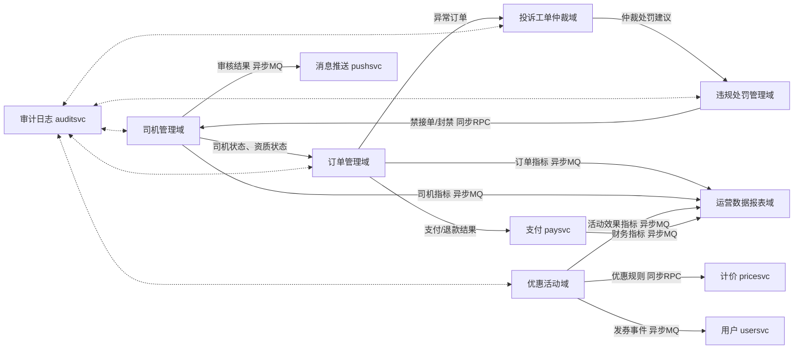
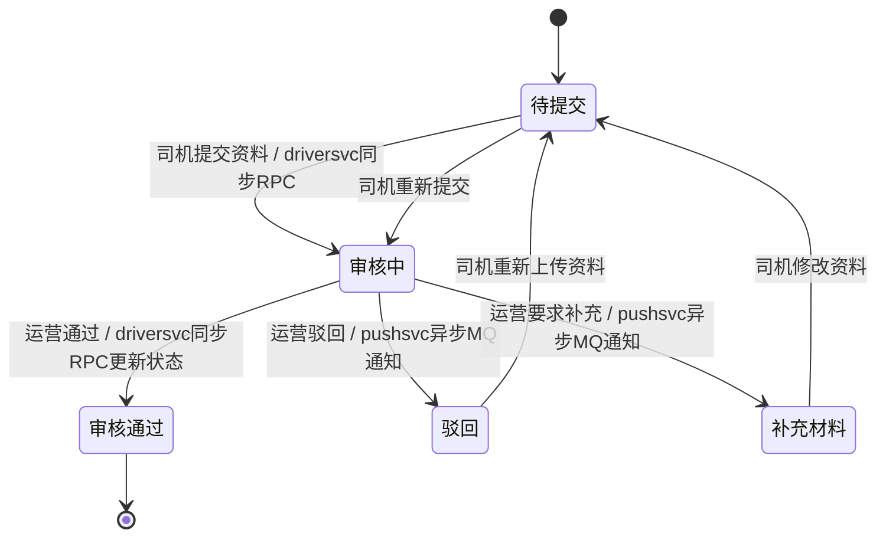
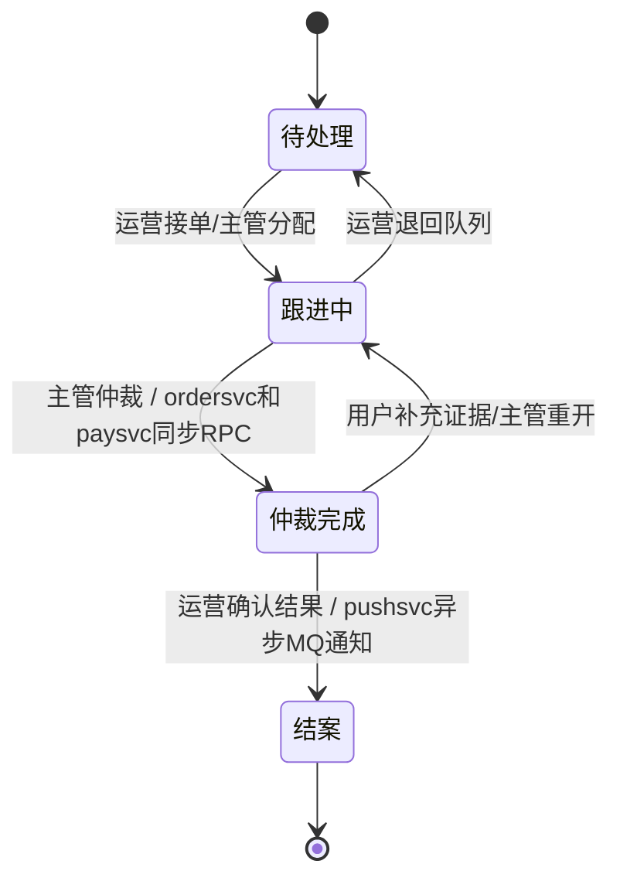
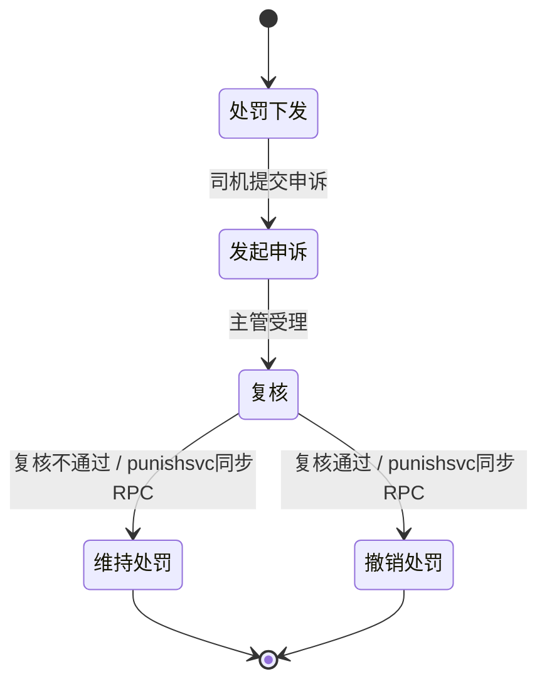
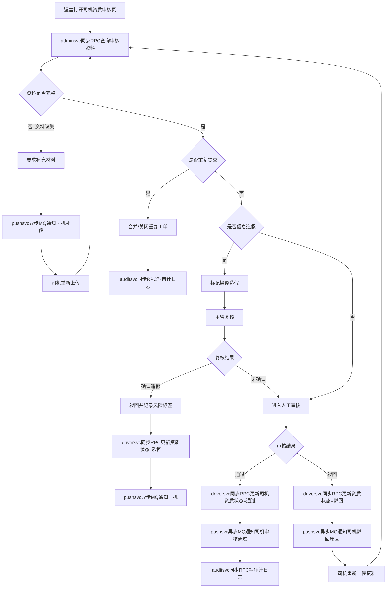
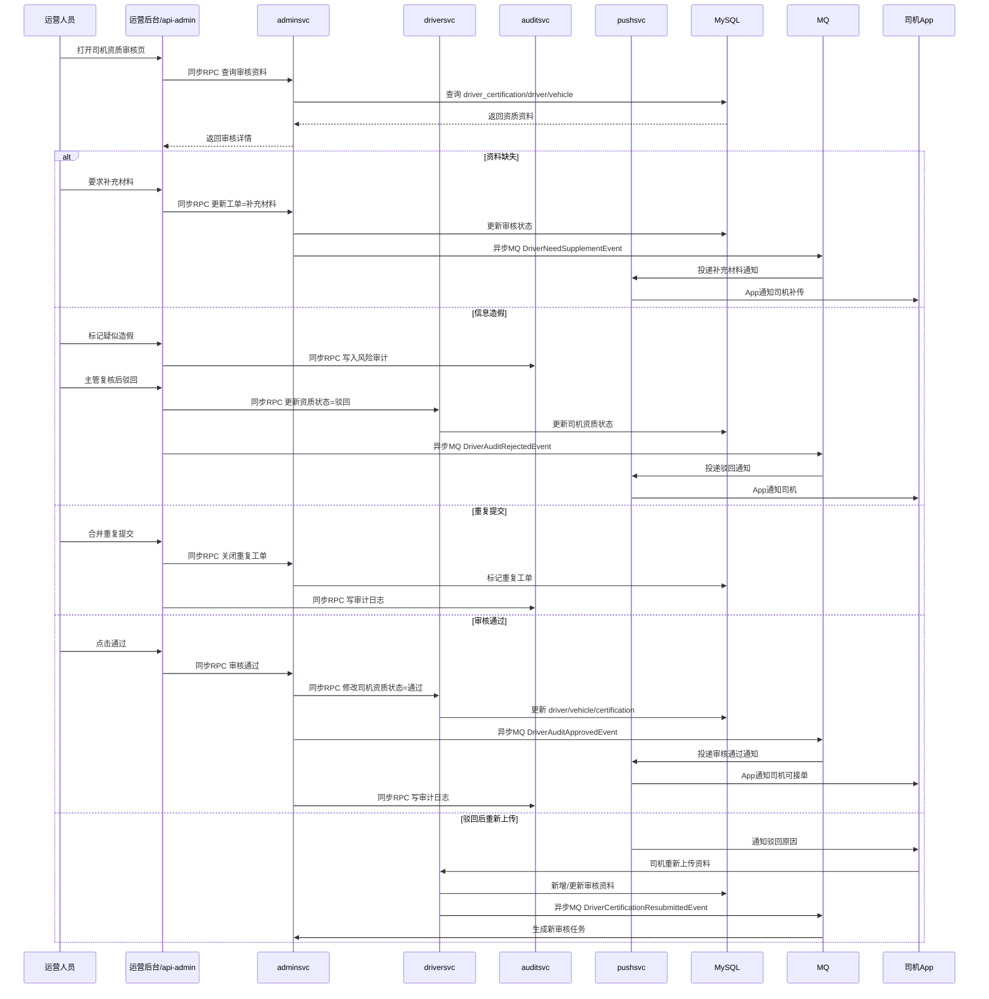
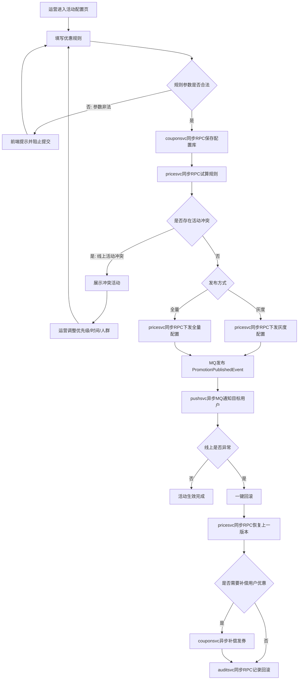
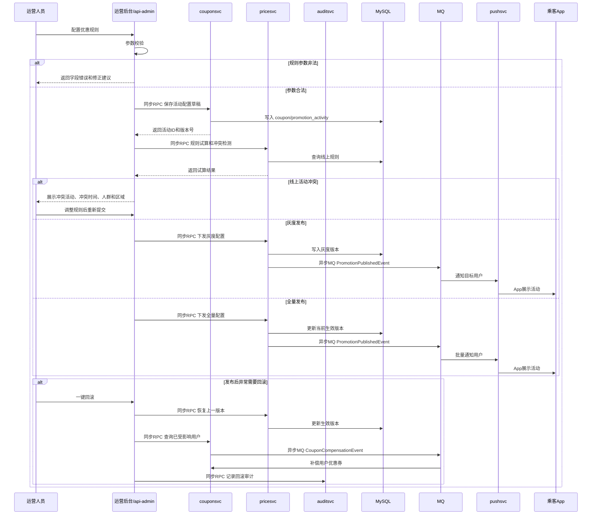
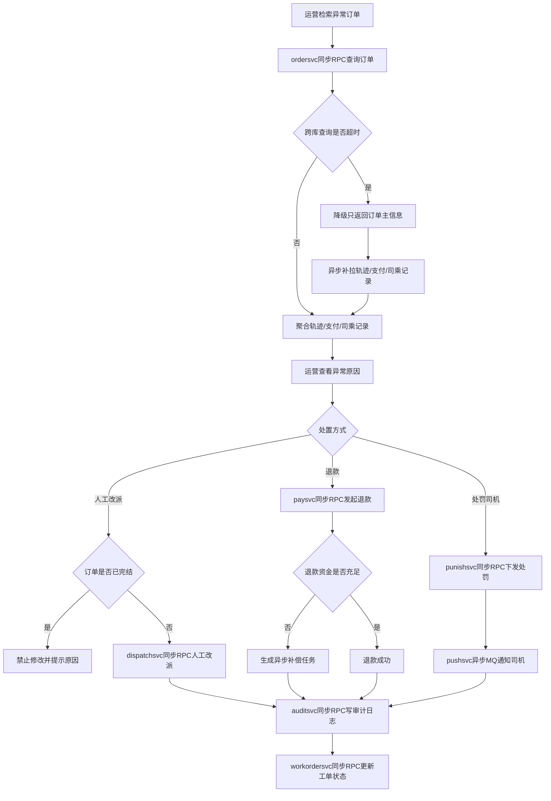
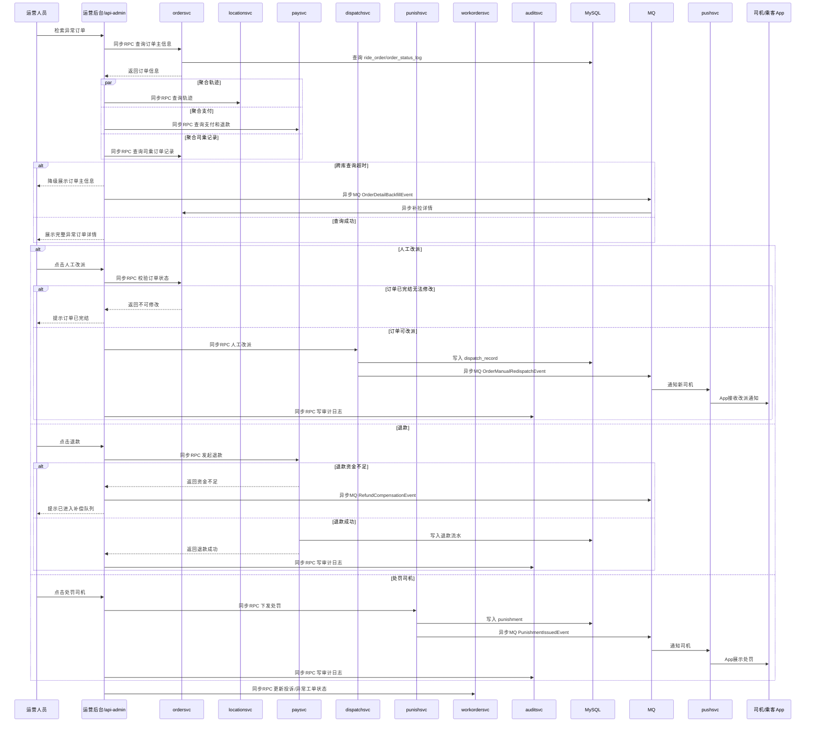

# 网约车运营管理后台完整设计输出

> 项目背景：网约车打车 App 运营管理后台
>
> 适用模块：`api/admin`、`rpc/adminsvc`
>
> RPC 命名统一约定：`adminsvc`、`driversvc`、`ordersvc`、`dispatchsvc`、`usersvc`、`pricesvc`、`paysvc`、`locationsvc`、`pushsvc`、`couponsvc`、`workordersvc`、`punishsvc`、`reportsvc`、`auditsvc`
>
> 调用类型标记：`同步RPC` 表示强一致在线调用；`异步MQ` 表示事件通知、异步补偿或最终一致处理。

## 一、后台 6 大独立业务域设计

### 1.1 业务域总览

| 业务域 | 定位 | 核心对象 | 主要依赖 RPC | 主要异步 MQ 事件 |
| --- | --- | --- | --- | --- |
| 司机管理域 | 管理司机入驻、资质、车辆、服务状态和审核工单 | 司机、车辆、资质审核工单 | `driversvc`、`pushsvc`、`auditsvc` | `DriverAuditResultEvent`、`DriverProfileChangedEvent` |
| 订单管理域 | 查询订单、异常订单、改派、退款协同和订单详情聚合 | 订单、派单、轨迹、支付、结算 | `ordersvc`、`dispatchsvc`、`locationsvc`、`paysvc`、`auditsvc` | `OrderExceptionEvent`、`OrderManualInterventionEvent` |
| 优惠活动域 | 配置优惠券、活动规则、灰度发布和回滚 | 优惠券、活动、计价规则 | `couponsvc`、`pricesvc`、`usersvc`、`pushsvc`、`auditsvc` | `CouponIssuedEvent`、`PromotionPublishedEvent`、`PromotionRollbackEvent` |
| 投诉工单仲裁域 | 处理用户投诉、订单申诉和客服仲裁 | 投诉工单、申诉工单、证据材料 | `workordersvc`、`ordersvc`、`locationsvc`、`paysvc`、`pushsvc`、`auditsvc` | `WorkOrderTimeoutEvent`、`ArbitrationFinishedEvent` |
| 违规处罚管理域 | 管理司机违规、处罚下发、处罚申诉和复核 | 违规记录、处罚单、申诉单 | `punishsvc`、`driversvc`、`ordersvc`、`pushsvc`、`auditsvc` | `PunishmentIssuedEvent`、`PunishmentAppealEvent` |
| 运营数据报表域 | 展示核心运营指标、导出报表和经营分析 | 指标、报表任务、导出文件 | `reportsvc`、`ordersvc`、`driversvc`、`usersvc`、`paysvc` | `ReportBuildEvent`、`ReportExportFinishedEvent` |

### 1.2 司机管理域

| 页面 | 页面说明 | 单条操作按钮 | 批量操作功能 | 依赖 RPC |
| --- | --- | --- | --- | --- |
| 司机列表 | 查询司机基础资料、服务状态、审核状态 | 查看详情、冻结、解冻、查看订单、查看车辆 | 批量冻结、批量导出 | `driversvc`、`ordersvc`、`auditsvc` |
| 司机详情 | 展示司机实名信息、评分、历史订单、处罚记录 | 编辑备注、查看轨迹、查看处罚、发起处罚 | 无 | `driversvc`、`ordersvc`、`punishsvc` |
| 车辆管理 | 查看车辆信息、车牌、车型、审核状态 | 查看车辆详情、停用车辆、恢复车辆 | 批量停用 | `driversvc` |
| 司机资质审核 | 处理司机身份证、驾驶证、行驶证、车辆资料 | 通过、驳回、要求补充材料、标记疑似造假 | 批量分配审核员、批量导出 | `driversvc`、`pushsvc`、`auditsvc` |
| 司机资质变更记录 | 查看司机资料变更历史和审核留痕 | 查看变更详情、回滚备注 | 批量导出 | `driversvc`、`auditsvc` |

### 1.3 订单管理域

| 页面 | 页面说明 | 单条操作按钮 | 批量操作功能 | 依赖 RPC |
| --- | --- | --- | --- | --- |
| 订单列表 | 按订单号、用户、司机、状态、时间查询订单 | 查看详情、标记异常、进入投诉处理 | 批量导出 | `ordersvc`、`usersvc`、`driversvc` |
| 订单详情 | 聚合订单、派单、支付、结算、轨迹和日志 | 人工改派、发起退款、处罚司机、写备注 | 无 | `ordersvc`、`dispatchsvc`、`locationsvc`、`paysvc`、`punishsvc` |
| 异常订单 | 展示超时、取消、支付异常、轨迹异常订单 | 处理、转投诉工单、关闭异常 | 批量关闭、批量转工单 | `ordersvc`、`workordersvc` |
| 派单监控 | 查看派单记录、匹配分、司机响应 | 重新派单、终止派单 | 批量重试派单 | `dispatchsvc`、`ordersvc` |
| 退款记录 | 查询退款申请、退款结果和失败原因 | 重试退款、查看支付流水 | 批量导出 | `paysvc`、`auditsvc` |

### 1.4 优惠活动域

| 页面 | 页面说明 | 单条操作按钮 | 批量操作功能 | 依赖 RPC |
| --- | --- | --- | --- | --- |
| 优惠券模板 | 配置券类型、门槛、面额、有效期 | 新建、编辑、复制、停用、发券 | 批量停用、批量导出 | `couponsvc`、`auditsvc` |
| 用户券列表 | 查询用户已领券、已用券、过期券 | 补发、作废、查看使用订单 | 批量补发、批量作废 | `couponsvc`、`usersvc`、`ordersvc` |
| 活动配置 | 配置拉新、满减、区域、时段活动 | 保存草稿、发布、灰度、回滚 | 批量下线 | `couponsvc`、`pricesvc`、`pushsvc` |
| 活动冲突检测 | 检查同区域、同人群、同时间活动冲突 | 查看冲突、调整优先级 | 批量检测 | `couponsvc`、`pricesvc` |
| 活动发布记录 | 查看发布、回滚、灰度记录 | 查看详情、重试下发 | 批量导出 | `couponsvc`、`pricesvc`、`auditsvc` |

### 1.5 投诉工单仲裁域

| 页面 | 页面说明 | 单条操作按钮 | 批量操作功能 | 依赖 RPC |
| --- | --- | --- | --- | --- |
| 投诉工单列表 | 查询乘客投诉、司机投诉、订单申诉 | 接单、分配、跟进、仲裁、结案 | 批量分配、批量导出 | `workordersvc`、`ordersvc`、`auditsvc` |
| 工单详情 | 展示投诉内容、证据、司乘资料、订单资料 | 添加备注、联系司乘、退款、处罚、结案 | 无 | `workordersvc`、`ordersvc`、`paysvc`、`punishsvc` |
| 仲裁证据中心 | 聚合轨迹、录音、支付、聊天、评价 | 查看证据、补充证据、标记无效证据 | 批量归档 | `locationsvc`、`ordersvc`、`paysvc` |
| 超时工单 | 展示 SLA 超时或即将超时工单 | 升级主管、催办、自动分派 | 批量升级 | `workordersvc`、`pushsvc` |

### 1.6 违规处罚管理域

| 页面 | 页面说明 | 单条操作按钮 | 批量操作功能 | 依赖 RPC |
| --- | --- | --- | --- | --- |
| 违规记录列表 | 查询司机绕路、拒载、爽约、恶意取消等违规 | 查看详情、下发处罚、转申诉 | 批量处罚、批量导出 | `punishsvc`、`driversvc`、`ordersvc` |
| 处罚单列表 | 查询罚款、禁接单、降权、封禁处罚 | 查看、撤销、加重、通知司机 | 批量通知 | `punishsvc`、`pushsvc` |
| 处罚申诉 | 处理司机对处罚的申诉 | 受理、复核、维持处罚、撤销处罚 | 批量分配复核人 | `punishsvc`、`driversvc`、`auditsvc` |
| 规则配置 | 配置违规规则、扣分、处罚梯度 | 新建、编辑、启用、停用 | 批量启停 | `punishsvc` |

### 1.7 运营数据报表域

| 页面 | 页面说明 | 单条操作按钮 | 批量操作功能 | 依赖 RPC |
| --- | --- | --- | --- | --- |
| 运营总览 | 展示订单、GMV、活跃用户、活跃司机 | 切换时间、切换城市、下载截图 | 无 | `reportsvc`、`ordersvc`、`paysvc` |
| 订单报表 | 查看订单量、完成率、取消率、异常率 | 查看明细、导出 | 批量导出任务 | `reportsvc`、`ordersvc` |
| 司机报表 | 查看入驻、审核、在线、接单、收入数据 | 查看明细、导出 | 批量导出任务 | `reportsvc`、`driversvc` |
| 用户报表 | 查看新增、活跃、留存、投诉数据 | 查看明细、导出 | 批量导出任务 | `reportsvc`、`usersvc` |
| 财务报表 | 查看支付、退款、结算、补贴数据 | 查看明细、导出 | 批量导出任务 | `reportsvc`、`paysvc` |
| 导出任务中心 | 管理大数据导出任务 | 下载、重试、取消 | 批量删除过期文件 | `reportsvc` |

### 1.8 业务域数据联动关系

## 二、3 套核心工单状态机

### 2.1 司机资质审核工单状态机

| 状态 | 允许触发操作 | 普通运营 | 主管 | 超管 | 超时自动流转规则 |
| --- | --- | --- | --- | --- | --- |
| 待提交 | 司机提交资料、司机重新上传 | 只读 | 只读 | 只读 | 超过 7 天未提交，`workordersvc` 标记为已过期草稿 |
| 审核中 | 通过、驳回、要求补充材料、标记疑似造假 | 可通过、驳回、要求补充材料 | 可处理疑似造假、二次复核 | 可强制关闭、恢复异常工单 | 超过 24 小时未审核，自动升级主管；超过 48 小时通知超管 |
| 审核通过 | 查看、导出、回溯审计 | 只读 | 只读 | 可发起状态纠错 | 终态，不自动流转 |
| 驳回 | 查看驳回原因、等待司机重传 | 只读 | 可修改驳回说明 | 可撤销驳回并恢复审核中 | 司机 15 天未重传，自动关闭工单 |
| 补充材料 | 等待司机补传、催办通知 | 可催办 | 可转驳回 | 可强制关闭 | 超过 72 小时未补充，自动催办；超过 7 天转驳回 |

### 2.2 用户投诉 & 订单申诉工单状态机

| 状态 | 允许触发操作 | 普通运营 | 主管 | 超管 | 超时自动流转规则 |
| --- | --- | --- | --- | --- | --- |
| 待处理 | 接单、分配、标记紧急、关闭无效工单 | 可接单、标记紧急 | 可批量分配、关闭无效 | 可调整优先级策略 | 超过 2 小时未接单，自动分配；超过 4 小时升级主管 |
| 跟进中 | 添加备注、联系司乘、调取证据、申请退款、建议处罚 | 可跟进、补充证据 | 可批准退款、处罚建议 | 可强制退款、强制结案 | 超过 24 小时未更新，自动催办；超过 48 小时升级超管 |
| 仲裁完成 | 查看仲裁结果、通知用户、进入结案 | 可通知、结案 | 可重开、修改仲裁 | 可撤销仲裁 | 超过 12 小时未通知，自动发送站内信和短信 |
| 结案 | 查看、导出、评价客服结果 | 只读 | 可重开一次 | 可无限制重开并留痕 | 终态，不自动流转 |

### 2.3 司机违规处罚申诉工单状态机

| 状态 | 允许触发操作 | 普通运营 | 主管 | 超管 | 超时自动流转规则 |
| --- | --- | --- | --- | --- | --- |
| 处罚下发 | 查看处罚、通知司机、等待申诉 | 只读、补充备注 | 可调整处罚说明 | 可撤销误处罚 | 司机 7 天未申诉，处罚自动生效并关闭申诉入口 |
| 发起申诉 | 查看申诉材料、补充证据、受理/驳回受理 | 可初筛材料 | 可受理进入复核 | 可直接进入复核 | 超过 24 小时未受理，自动分配主管 |
| 复核 | 维持处罚、撤销处罚、要求补充材料 | 只读、补充证据 | 可维持或撤销 | 可二次复核、强制撤销 | 超过 48 小时未复核，自动升级超管 |
| 维持处罚 | 通知司机、记录复核结论 | 可通知 | 可补充说明 | 可重开复核 | 终态，不自动流转 |
| 撤销处罚 | 恢复司机权益、返还扣款、通知司机 | 可通知 | 可确认权益恢复 | 可强制补偿 | 终态；若补偿失败，异步补偿任务重试 3 次 |

## 三、3 条后台核心业务全链路

### 3.1 主线一：司机入驻人工审核全流程

#### 3.1.1 业务流程图

#### 3.1.2 Mermaid 时序图

### 3.2 主线二：优惠券 / 活动配置发布流程

#### 3.2.1 业务流程图

#### 3.2.2 Mermaid 时序图

### 3.3 主线三：异常订单 & 投诉处置流程

#### 3.3.1 业务流程图

#### 3.3.2 Mermaid 时序图

## 四、后台特有异常场景清单

| 异常场景 | 场景描述 | 风险影响 | 解决方案 |
| --- | --- | --- | --- |
| 海量查询超时 | 运营按大时间范围、全城市、无筛选条件查询订单/司机/工单 | 拖慢数据库，后台页面长时间无响应，影响其他查询 | 强制分页、限制时间范围、索引优化、读库查询、超过阈值转异步导出任务 |
| 大数据导出内存溢出 | 一次性导出百万级订单、支付流水或报表明细 | 服务 OOM，导出失败，影响在线接口 | 使用异步导出任务、游标分页、分片写文件、对象存储落盘、导出完成 MQ 通知 |
| 配置下发失败 | 优惠活动或处罚规则保存成功，但下发 `pricesvc` / `punishsvc` 失败 | 配置库和线上生效规则不一致，可能造成价格错误或处罚漏判 | 配置版本号、发布事务表、失败重试、灰度前预检查、一键回滚、异步补偿 |
| 越权操作 | 普通运营执行超管操作，如强制退款、撤销处罚、批量冻结司机 | 资金损失、合规风险、审计追责困难 | RBAC 权限校验、接口级鉴权、二次确认、敏感操作审批流、`auditsvc` 强制留痕 |
| 重复审核 | 多个运营同时打开同一司机审核工单并提交不同结果 | 审核状态被覆盖，司机状态不一致 | 工单乐观锁 version、审核中加分布式锁、提交前状态校验、幂等 key |
| 报表统计延迟 | 订单、支付、司机在线数据通过 MQ 汇总，存在分钟级延迟 | 运营看到的数据非实时，影响决策 | 标注数据更新时间、T+0 近实时指标与 T+1 准确报表分层、延迟告警、补偿重算 |
| 多运营同时修改同一工单冲突 | 多人同时修改投诉工单、处罚申诉或活动配置 | 备注丢失、状态错乱、责任不清 | 乐观锁、编辑占用、变更 diff、提交冲突提示、审计日志记录旧值和新值 |
| 跨库查询超时 | 异常订单详情同时查订单、轨迹、支付、派单、司乘记录 | 页面无法完整展示，运营无法处置 | 主信息优先返回、详情分块懒加载、超时降级、异步补拉、缓存热点订单 |
| 退款资金不足 | 投诉仲裁或异常订单退款时支付渠道余额不足 | 用户补偿延迟，投诉升级 | 退款预检查、补偿队列、财务告警、重试策略、人工审批备用通道 |
| 订单已完结无法修改 | 运营尝试对已完结订单执行改派或修改状态 | 破坏订单状态机，造成结算错误 | `ordersvc` 状态机拦截、后台按钮置灰、只允许发起售后工单 |
| 线上活动冲突 | 同一城市、同一人群、同一时间存在多个互斥活动 | 用户优惠叠加异常，计价结果错误 | `pricesvc` 规则试算、冲突检测、优先级校验、发布前审批 |
| 回滚后用户优惠需补偿 | 活动错误回滚后，部分用户已经领取或使用错误优惠 | 用户权益争议、资金核算错误 | 影响用户圈定、补偿券异步发放、补偿记录、财务对账 |
| 消息推送失败 | 审核结果、处罚结果、仲裁结果未成功通知 App | 用户/司机不知道处理结果，重复投诉 | MQ 重试、死信队列、站内信兜底、短信兜底、通知状态可查询 |
| 审计日志写入失败 | 敏感操作成功但审计写入失败 | 无法追责，合规风险 | 敏感操作与审计同事务或本地消息表，审计失败阻断高危操作 |

