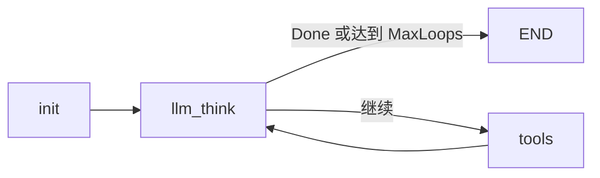

# 受控 ReAct Agent 最小骨架

目录：`agent/react`

## 运行

```bash
go run ./cmd/react-agent "帮我查商品1001多少钱"
```

默认 mock 模型会完成两轮：

1. `llm_think` 产生 `get_product_price` tool call。
2. `tools` 执行工具并写入 ToolMessage 与 Observation。
3. 回到 `llm_think`，生成最终答案并结束。

## Graph 链路



`AgentState` 是 Graph 的输入和输出，包含问题、完整消息历史、Thought、ToolCalls、Observations、最终答案和循环控制字段。Graph 分支由 Go 代码检查 `Done` 与 `LoopCount`，同时编译时设置 `WithMaxRunSteps`，模型不能自行控制循环次数。

`ScriptedModel` 只是无外部依赖的确定性演示模型；接入真实 Eino ChatModel 时，实现 `ThinkModel`，并把 `ToolRegistry.Infos()` 绑定给模型即可。当前不包含业务工单、RAG、持久化或前端。