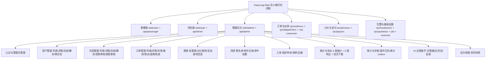
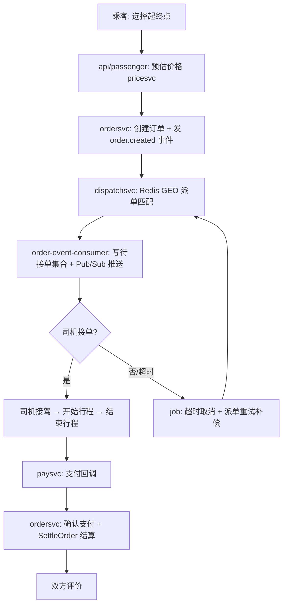
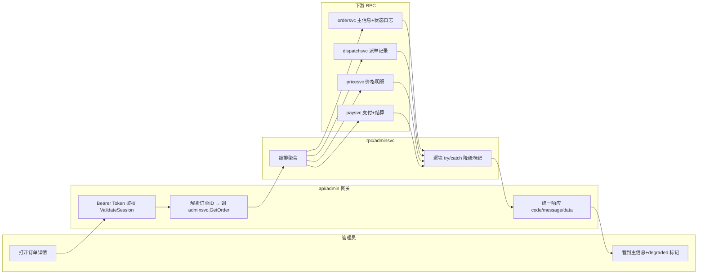
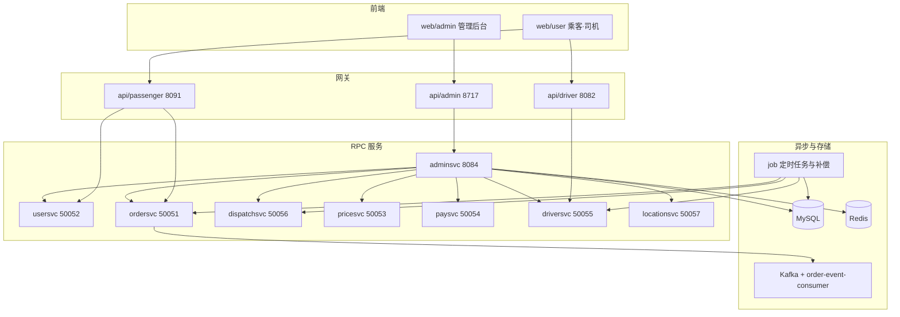

# 答辩设计（成员 C · 管理后台）

- 项目：XiaoLong-Ridy 花小猪打车（仿）
- 本人负责：**模块三 管理后台**（`api/admin` + `rpc/adminsvc` + `web/admin`）
- 形式：**25–30 分钟**，含共享屏演示（按 30 分钟上限设计，语速偏慢 + 预留老师提问）
- 日期：2026-09-07

---

## 零、时间分配（30 分钟口径，约 2 分钟提问缓冲）

| 时段 | 时长 | 内容 | 对应要求 |
| --- | --- | --- | --- |
| 0:00-1:30 | 1.5' | 自我介绍 + 项目背景 + 本组分工与本人负责 | ⑩⑫ |
| 1:30-5:00 | 3.5' | 需求分析怎么做 + 原型图之后的工作 + 原型分析方式 + 需求 skills | ②③④⑨ |
| 5:00-7:30 | 2.5' | 功能结构图（十一个子域逐个点） | ①⑥ |
| 7:30-10:30 | 3' | 架构分层 + 技术方案 + 八下游非阻塞与降级 | ①⑥⑦ |
| 10:30-18:00 | 7.5' | **共享屏演示（前端优先）**：登录→工作台→用户→司机→订单详情→风控→导出→AI | ⑪ |
| 18:00-22:30 | 4.5' | 难点四则：现象 → 根因 → 方案 → 验证 | ⑫ |
| 22:30-24:30 | 2' | 测试：路由冒烟 / 单元测试 / sqlmock / 真实联调 / 定时任务 | ⑫ |
| 24:30-26:30 | 2' | 优化前后对比（五项） | ⑫ |
| 26:30-29:00 | 2.5' | AI 使用准确度与防幻觉（**讲慢，留提问钩子**） | ⑧⑫ |
| 29:00-30:00 | 1' | 发布上线 / Linux 可执行文件 / 多服务 / 监控规划 + 自我总结 | ⑫ |

> 控时技巧：演示段最容易被追问打断，若超时优先压缩"功能结构图"逐点讲解，保住演示与 AI 两段。

---

## 一、图（mermaid 源码，可直接渲染）

> 渲染：贴进 https://mermaid.live 、Typora 或 VSCode（Mermaid 插件）即可出图，也可作为 PPT/文档的矢量图源。

### 1.1 项目功能结构图

### 1.2 核心业务流程图（乘客叫车主链路）

### 1.3 泳道图（一次"订单详情聚合"的跨服务协作）

### 1.4（加分）技术架构图

---

## 二、逐字口述稿（30 分钟版，可直接念）

> 括号内容是动作提示，**不要念出来**。语速按每分钟约 200 字，偏慢、留停顿。

### 【0:00-1:30】自我介绍与项目背景

"各位老师好，我是本组的成员 C，学号/姓名（自行补充）。在 XiaoLong-Ridy 花小猪打车仿制项目中，我负责的是**模块三：管理后台**，具体是三个部分：`api/admin` 后台 HTTP 网关、`rpc/adminsvc` 后台业务服务，以及 `web/admin` 管理前端。

先说一下项目整体。我们这个项目是六位同学按六个模块协作的 Go 微服务网约车系统，目标是把'乘客叫车 → 派单 → 司机接单 → 接驾 → 行程 → 支付 → 结算'这条主链路打通，同时由管理后台完成运营、营销、风控和数据闭环。本月我们处在**联调收口阶段**：主链路已经跑通，重点是稳定性、边界收口和异常补偿。

我这个模块在里面的定位是'运营的眼睛和手'——主链路产生的用户、司机、订单、支付数据，最终都要在后台被看到、被管理、被审计。"

### 【1:30-5:00】需求分析、原型图之后的工作、原型分析方式、需求相关技能

"接下来讲我是怎么做需求分析的。我按四步走。

**第一步，拆角色场景。** 我先不管技术，只问'谁要用、用来干什么'。乘客要能注册登录、叫车、看行程、支付；司机要能认证、接单、服务、提现；运营要在后台管用户、管司机资质、处理异常订单、发优惠券、看数据；平台还要能风控，识别恶意取消、刷单这些行为。这一步产出的不是代码，是角色场景清单。

**第二步，功能清单与优先级。** 我把场景转成功能，并强行排 P0/P1/P2。P0 是'没有它主链路就不完整'的，比如订单取消、司机审核、用户冻结；P1 是能力补强，比如统计、导出、工单；P2 是架构演进，比如把优惠券、工单拆成独立服务。这样排的好处是联调时间紧的时候，我知道先保什么、后做什么，不会平均用力。

**第三步，接口契约。** 这是我花时间最多的地方：每个功能落成接口，写清楚路径、方法、请求字段、响应字段、错误码、权限。比如'冻结用户'，我要明确是 `POST /admin/v1/users/{id}/freeze`，请求体是 reason 和 remark，响应是统一结构，权限是超管和运营，失败码是 40001 参数错误、40300 无权限、40401 用户不存在。**接口契约一写死，前后端就可以并行开发了**，这是我觉得最重要的一步。

**第四步，验收标准和测试用例。** 每个接口都要能被冒烟测试覆盖：正常路径、参数缺失、无权限、资源不存在各来一条。没有验收标准，'做完了'这三个字就没有依据。

**拿到原型图之后我做了五件事。** 第一，**页面反推接口**：原型上每一个列表页、详情页、每一个按钮，都要落到一个真实接口。我会逐个检查，不允许出现'页面上有这个按钮，但后台没有对应接口'的空壳功能——空壳在答辩和联调时一定会暴露。第二，**字段与枚举对齐**：订单状态 1 到 6、审核状态 1 待审 2 通过 3 驳回、优惠券类型 1 满减 2 折扣 3 立减，前后端必须同一套枚举，我在文档里逐个写死。第三，**权限矩阵**：超管、运营、客服在同一按钮上分别是可用、只读、隐藏，并且写明'前端隐藏不能替代服务端校验'。第四，**服务边界**：后台不直连其他域的表，跨域数据一律走 RPC，避免以后拆服务时到处是隐式依赖。第五，**异常态设计**：空态、加载失败、无权限、状态冲突——这些原型通常不画，但必须写进接口文档，否则前端只能自己猜。

**原型图的分析方式我总结成'三看'。** 一看主流程：用户从进入到完成的最短路径，确认这条路径上每个节点都有数据支撑。二看分支：失败、超时、冲突，比如订单已经完成了还点取消，系统会怎么拒绝。三看数据：这个页面读哪些表、写哪些表、这些表归谁所有——**看数据直接决定了后面的 RPC 边界**。

**用到的需求分析技能**：角色场景建模、用户故事拆解、MoSCoW/P0-P2 优先级、接口契约设计、状态机与枚举建模，以及用文档把需求冻结。我们 `docs/` 目录下的需求文档、接口文档、HTTP 到 RPC 边界说明，本质上都是需求产物，我一直保持代码和文档同步，避免'文档写一套、代码是另一套'。"

### 【5:00-7:30】功能结构图

"（切到 1.1 功能结构图）这是整个项目的功能结构。我负责的右下这一支——管理后台，一共十一个子域：

第一，认证与管理员管理：登录、菜单权限、超管创建和停用其他管理员。
第二，用户管理：列表、详情、冻结解冻、以及他的订单历史和优惠券历史。
第三，司机管理：列表、详情、冻结解冻、资质审核、提现审核。
第四，订单管理：列表、详情、异常订单、后台取消、人工改派、退款、轨迹。
第五，营销：优惠券模板、发券、计价规则、活动发布与回滚。
第六，风控：黑名单、命中记录、命中处置。
第七，工单：投诉申诉工单、流转、证据索引。
第八，统计与导出：六类统计、五类导出、流式下载。
第九，审计与补偿：操作日志、审计 outbox 重放。
第十，AI 运营助手。
第十一，运力地图实时快照。

这十一个子域加起来大概是七十多个接口，全部在接口文档里有定义，也都进过冒烟测试。"

### 【7:30-10:30】架构与技术方案

"（切到 1.4 架构图）架构上是四层：**前端 → HTTP 网关 → 后台业务服务 → 各业务域服务**。

网关这一层我做得很克制，只做四件事：鉴权、参数校验、协议转换、统一响应。**网关不写业务表，也不直接调别人的数据库**。它拿到 Bearer Token 之后，会调后台服务校验会话，校验通过后把 token 透传给下游，由后台服务再做角色权限判断——也就是**服务端 RBAC，前端菜单隐藏只是体验，不是安全边界**。

后台服务 `adminsvc` 这一层负责编排：它自己拥有运营类表（操作日志、工单、黑名单、导出任务、发券任务等），跨域数据一律走 RPC。后台一共接了八个下游：订单、用户、派单、司机、计价、支付、位置、推送。**这八个全部是非阻塞懒连接**，也就是说某个下游没起来，后台照样能启动，不会因为一个服务挂了就整体不可用。

**技术方案上我重点解决的是'聚合查询的可用性'。** 一个订单详情要同时取六块数据：订单主信息、状态流转、派单记录、价格明细、支付、结算。我的做法是每块独立调用、独立捕获错误，失败就把这一块的名字写进响应里的 `degraded` 字段，主信息照样返回。**宁可少给一块，也不能整页白屏。** 这个 `degraded` 字段一会儿演示的时候我会指给老师看。

技术选型：Go 加 go-zero 风格，服务间 gRPC 加 protobuf，MySQL 做业务存储，Redis 做会话和 GEO 派单，Kafka 做订单事件，前端 Vue3。**数据一致性上我用的是'本地事务 + 补偿'而不是分布式事务**：业务和审计在同一个本地事务里提交，跨服务动作失败就落 outbox 表，由定时任务重放。这个我待会儿在难点里详细讲。"

### 【10:30-18:00】共享屏演示（前端优先）

"下面我做演示。（按第四章动线操作）

**（1）登录与工作台）** 这是管理后台首页，登录用的是超管账号。进来之后是统计卡片——用户数、司机数、订单数、完成率、GMV、发券量、黑名单数，这些数据来自后台六类统计接口，是实时聚合的，没有单独的报表服务。

**（2）用户管理）** 用户列表支持关键字、状态、注册时间筛选。点进详情——注意手机号和身份证默认是脱敏的，这是合规要求；如果运营确实需要看明文，要显式申请（带 sensitive 参数），并且**只有超管和运营能看，看完会写一条审计日志**。下面还有这个用户的订单历史和优惠券历史，这两个是走订单服务和用户服务查的，后台不直读他们的表。

**（3）司机管理）** 资质审核列表，可以看到待审核的司机，点通过——这一步会联动司机域：认证状态、司机状态、车辆状态在司机服务的事务里一起更新。驳回则只改认证状态，不激活司机和车辆。再看冻结和解冻，以及提现审核：提现审核通过代表打款成功，驳回代表打款失败，状态由司机服务流转。

**（4）订单管理 —— 这里是重点）** 打开一个订单详情。**请老师看响应里的 `degraded` 字段**：这次价格、支付、结算三块是空的，因为这张订单还在行程中、没有支付记录；但订单主信息、状态流转、派单记录都正常返回。这个设计的意义是：如果价格服务或者支付服务抖动甚至宕机，页面依然能打开，只是对应区块空掉并明确标记，而不是整页 500。这也是我后面讲难点一的实际案例。

再看轨迹：轨迹点来自位置服务，司机上报位置时会写入轨迹表。改派和退款是写操作，需要幂等号，这里我就不在真实订单上点了，避免污染数据。

**（5）风控）** 黑名单支持按用户、司机、设备、手机号拉黑；命中记录是登录、下单、支付这些场景的风控命中；处置动作有四种：复核通过、拉黑、转工单、直接冻结。冻结会按目标类型分别调用用户服务或司机服务。

**（6）导出）** 创建导出任务，支持用户、司机、订单、操作日志、统计五类；任务异步生成 CSV；下载是流式的，响应头带附件文件名，而且**不会把服务器文件路径暴露给前端**——下载前会校验是不是本人创建或者超管。

**（7）AI 运营助手）** 我问一句'今日运营情况如何'。请老师注意它返回的不是一个自由文本，而是四段结构化内容：摘要、证据列表、待处理优先级、建议动作。而且它带了一个 `source_mode` 字段标明数据来源。**这个字段是防幻觉的关键，我待会儿专门讲。**"

### 【18:00-22:30】难点四则

"我讲四个难点，每个都按'现象 → 根因 → 方案 → 验证'来说。

**难点一：多下游聚合的可用性。** 现象是订单详情这种聚合接口，只要有一个下游慢或者挂，整页就废。根因是串行调用里任何一个错误都会向上抛。方案是三条：八个下游全部非阻塞懒连接；每一块独立 try/catch；失败只降级对应块并写入 `degraded`。验证就是刚才演示的真实订单——三块缺失，主信息照常返回。

**难点二：跨服务状态一致与审计不丢。** 比如冻结司机，既要改司机域状态又要发通知，任何一步失败都会出现'业务成功了但审计没了'这种假成功。我的方案是：业务和审计放同一个本地事务；跨服务动作失败就写 `admin_audit_outbox` 补偿表；由定时任务每 30 秒扫描，用条件更新抢占任务避免多实例重复处理，然后按动作重放——审计重写、司机冻结重放、推送通知重放；失败计数，超过最大重试次数就置为 failed 保留失败原因，作为一个人工处理窗口。验证方式是本地跑定时任务，日志里能看到每轮扫描的条数和结果，也能在后台查询接口看到 pending 和 failed 的数量。

**难点三：超时对齐。** 现象是后台用户列表偶发 system error。根因是**超时是端到端传递的**：我们的数据库在远端，单条查询可能几百毫秒甚至更慢，而服务端默认两秒就先把请求截断了，客户端再怎么放宽都没用。方案是服务端和客户端两端一起放宽到 30 秒。验证是列表连续多次请求稳定返回。

**难点四：服务边界收敛。** 早期后台为了图快，直接读用户表和订单表。这带来两个问题：一是订单状态机只有订单服务能保证一致，后台直写会产生脏数据；二是以后要拆服务时到处是隐式依赖。我的做法是把用户列表、用户详情、订单列表、订单详情、发券这些逐步切到对应域服务的后台接口上，后台只保留编排和它自己拥有的运营表。验证是接口响应不变，但调用链变成 '网关 → 后台 → 域服务'。"

### 【22:30-24:30】测试

"测试我分四层。第一层是**路由冒烟**：所有已注册接口都有用例，覆盖正常返回、方法不允许、参数错误、无 token。第二层是**逻辑单元测试**：后台的计价规则、发券、风控处置这些有单元测试，数据库部分用 sqlmock，可以断言 SQL 和事务边界——比如发券要断言在同一事务里写任务表、发布记录和操作日志。第三层是**真实联调**：刚才演示的全部是真实数据、真实调用链。第四层是**定时任务验证**：我本地把定时任务跑起来，启动时会做一次补偿队列预检，打印退款队列、派单重试队列、审计 outbox 的积压；运行后能看到审计 outbox 每 30 秒扫描一次。"

### 【24:30-26:30】优化前后对比

"我讲五个可对比的优化点。

第一，**超时统一**：优化前用户列表偶发 system error，优化后稳定返回。
第二，**边界收敛**：优化前后台直读用户表和订单表，优化后走用户服务和订单服务的后台接口。
第三，**发券链路**：优化前后台直接写用户券表，优化后调用用户服务发放，后台只在本地事务里记任务和发布记录，库存和领取上限校验由用户服务负责。
第四，**导出能力**：优化前只支持订单导出，优化后支持五类，并补上了流式下载和下载鉴权。
第五，**AI 助手**：优化前运营看数要翻好几个页面自己拼结论，优化后一句话给出摘要、证据和待处理项。"

### 【26:30-29:00】AI 使用准确度与防幻觉（讲慢，留提问）

"最后讲 AI 这部分，我是当工程问题做的，核心思路是**不让模型自由发挥**。我用了五道闸门。

**第一，限场景。** 只允许三个场景：运营总览、异常订单、风控复核。场景不匹配直接拒绝，不接受开放域问答。

**第二，结构化输出加校验。** 模型输出必须是四段：摘要、证据、优先级、建议动作。服务端会校验结构，而且**建议动作只允许页面跳转，不允许任何写操作**——也就是说 AI 绝对不能改业务数据，它只能告诉运营'你应该去看哪个页面'。

**第三，数据来源可标注。** 回答里有一个 `source_mode` 字段：真实查询是 realtime，演示快照是 demo_snapshot，模型不可用或者没接真实模型时降级成 template_fallback。**我们本地现在没接真实大模型，所以老师刚才看到的其实是模板降级的结果，我不会假装它是模型实时生成的**——这个字段就是为了防止自欺欺人。

**第四，可审计。** 每次问答写一条脱敏审计：问题只存哈希不存原文，记录场景、耗时、来源模式、trace_id，出问题时能追溯到底问了什么、走了哪条路径。

**第五，权限与隔离。** 问答走同一套管理员鉴权，会话只属于本人，敏感字段不进模型上下文；会话暂存在 Redis，进程重启即清空，避免脏数据长期驻留。

一句话总结我的原则：**能查的才让它说，说了必须有证据，没有证据就明确标降级。**"（此处停顿，等老师提问）

### 【29:00-30:00】发布上线、Linux、多服务、监控与总结

"**发布上线流程**：构建产出可执行文件 → 配置和密钥用环境变量注入，绝不写进仓库 → 数据库迁移脚本按发布流程人工执行 → 灰度或分批放量 → 观察 → 有回滚预案。

**Linux 与可执行文件**：Go 支持交叉编译，一套代码 `GOOS=linux GOARCH=amd64 go build` 就能出各服务的 Linux 可执行文件，配合配置文件和端口规划部署。

**多服务开发**：我们九个 RPC 加三个网关，靠三件事解耦——端口规划、启动顺序（订单服务依赖派单和计价，支付依赖订单）、以及下游非阻塞连接。本地用一键脚本编排起停和日志收集。

**后期监控规划**三方面：一是补偿队列积压（退款队列、派单重试、审计 outbox 的 pending 和 failed）；二是慢 SQL 与 `degraded` 降级标记的采集；三是失败超阈值告警和人工处理窗口。

**自我总结**：这一个月我把管理后台从'接口能跑通'做到'可交付、可运营、可追溯'——补全了运营、风控、工单、统计导出、审计补偿这些闭环，把多下游聚合做成可降级，也把 AI 用成了受约束的运营助手。不足我也很清楚：人群包和灰度发券还没真正落地，它依赖用户服务提供人群查询能力；另外配置密钥外置这件事我还没做完，这是我下一步要补的。

我的汇报到这里，请老师指正。"

---

## 三、老师可能追问的题（预判）

| 问题 | 要点回答 |
| --- | --- |
| 你怎么证明 AI 没有瞎编？ | 三道闸门：限场景、结构化输出校验、`source_mode` 标注来源；无真实数据时不生成，只返回模板降级并标明 |
| AI 会不会改坏数据？ | 不会。建议动作只允许页面跳转，所有写操作必须人工在业务接口完成；AI 侧只有只读查询 |
| 后台为什么不直接查订单表？ | 跨域数据所有权问题。订单状态机只有 ordersvc 能保证一致性，后台直读会产生隐式耦合和脏读 |
| 一个下游挂了会怎样？ | 非阻塞连接 + 单块降级，`degraded` 字段标记，主信息照常返回 |
| 审计失败怎么办？ | 落 outbox，定时任务抢占重放，带重试上限，超限进 failed 人工窗口，可查可追 |
| 你说超时统一，为什么？ | 端到端超时是 ctx 传递的，只放宽一端无效，必须服务端和客户端一起调 |
| 多服务怎么保证幂等？ | 资金/状态类操作必须带 `request_id`，下游按幂等号去重 |
| 为什么不拆更多微服务？ | 当前瓶颈不在这。先保证可交付可追踪，领域复杂度上来再拆，避免为了"看起来像"造空壳服务 |
| 数据库密码写在配置里？ | 这是我现在明确的改进项：配置与密钥必须走环境变量注入，已泄露的凭证要轮换 |
| 订单详情为什么不做并发？ | 现在串行 + 单块降级已满足可用性；并发 + 单块超时是我后续的性能优化点 |
| 定时任务重复执行怎么办？ | 用条件更新抢占（CAS），只处理 pending 或超时的 running，避免多实例重复消费 |
| 你们怎么保证前后端枚举一致？ | 枚举写死在接口文档和类型定义中，前端按文档实现，接口层做参数校验 |

---

## 四、演示动线（共享屏操作清单）

### 4.0 演示账号（后台管理端）

| 项 | 值 |
| --- | --- |
| 管理后台地址 | `http://127.0.0.1:5173` |
| 后台 API | `http://127.0.0.1:8717` |
| 账号 | `admin` |
| 密码 | `123456` |
| 角色 | 超级管理员（role=1，拥有全部菜单与敏感信息查看权限） |

> 该账号为本地演示库账号，拥有最高权限，适合完整演示。

### 4.1 演示步骤

1. 打开 `http://127.0.0.1:5173` → 用上表账号登录
2. 工作台：统计卡片（对应 6 类统计接口）
3. 用户管理：列表 → 详情 → 敏感信息查看（说明审计）
4. 司机管理：资质审核 → 通过/驳回 → 冻结/解冻 → 提现审核
5. 订单管理：列表 → 详情（**重点讲 `degraded`**）→ 轨迹 → 说明退款/改派入口但不点真实写操作
6. 风控：黑名单 → 命中记录 → 命中处置
7. 导出：创建 → 列表 → 详情 → 下载
8. AI 助手：问一句 → 讲解 `source_mode` 与证据
9. 切回图：功能结构图 → 架构图 → 泳道图（讲边界与降级）

> 演示前执行 `powershell -ExecutionPolicy Bypass -File .\scripts\run-passenger-to-admin.ps1 -SkipBuild` 确认 14 个服务已启动；演示账号与数据以远程库当前数据为准。
