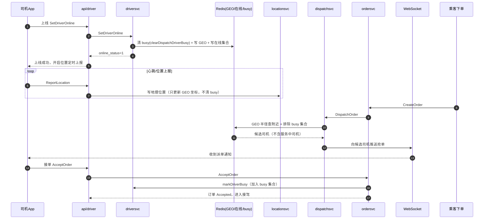
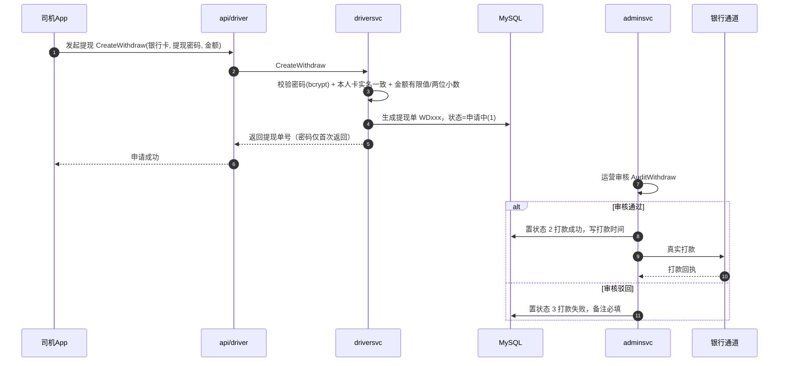
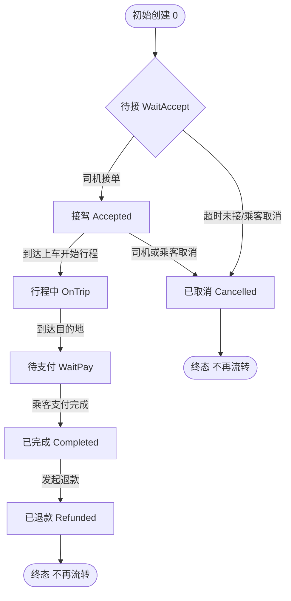
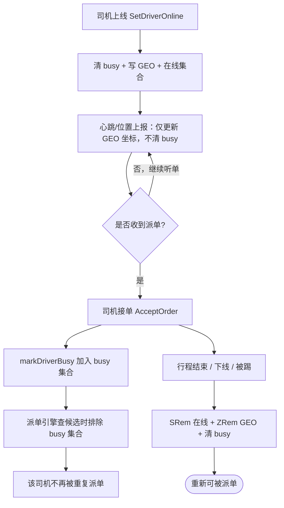
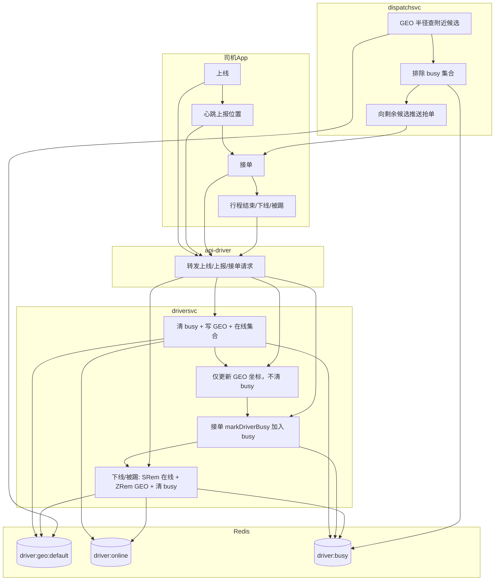

# 司机端六图（2 时序 + 2 流程 + 2 泳道）

> 对应《司机端模板示例两套.md》三套内容 + 机制卡片，全部基于真实代码，可直接在支持 Mermaid 的环境渲染。

---

## 时序图一：司机上线听单 → 派单 → 接单（对应 示例一 GEO key / 示例二 派单）



**代码出处**：`rpc/driversvc/internal/logic/set_driver_online_logic.go`（只在上线清 busy）、`dispatch_availability.go`（syncDispatchDriverOnline 只同步不清除 busy）、`rpc/ordersvc/internal/logic/accept_order_logic.go`（markDriverBusy）。

---

## 时序图二：提现申请 → 后台审核 → 打款（对应 示例一 提现防资损）



**代码出处**：`rpc/driversvc/internal/logic/create_withdraw_logic.go`（校验+生成单+状态 1）、`rpc/driversvc/proto/driversvc.proto`（AuditWithdraw：approve=true 置 2 打款，false 置 3）。

---

## 流程图一：行程订单状态机（对应 示例三 状态机非法跃迁）



**讲点**：所有流转过 `CanTransit` 集中校验，`OnTrip` 之后只能到 `WaitPay`，禁止跳状态。
**代码出处**：`rpc/ordersvc/internal/logic/state_machine.go`。

---

## 流程图二：busy 生命周期与防重复派单（对应 示例二 重复派单）



**讲点**：busy 是防重复派单的核心开关——只在「上线」清除，心跳/上报不清除；接单加入 busy；下线/被踢才清理。原 `Pipelined` 批量写会静默丢 `ZREM/SREM`，已改为逐条 `SRem/ZRem`。
**代码出处**：`dispatch_availability.go`（clearDispatchDriverBusy 仅上线调用、离线逐条 SRem/ZRem）、`set_driver_online_logic.go`、`accept_order_logic.go`（markDriverBusy）。

---

## 泳道图一：提现防资损（对应 示例一 提现）

```mermaid
flowchart TD
    subgraph 司机
        A1[发起提现申请] --> A2[选择本人已绑银行卡]
        A2 --> A3[输入平台提现密码]
    end
    subgraph driversvc司机服务端
        B1[校验密码 bcrypt] --> B2[校验卡为本人且实名一致]
        B2 --> B3[金额校验 有限值/两位小数]
        B3 --> B4[生成提现单 WD+时间+随机<br/>状态=申请中(1)]
    end
    subgraph adminsvc管理后台
        C1[运营审核 通过/驳回] --> C2{approve?}
        C2 -->|通过| C3[置状态 2 打款成功<br/>写打款时间]
        C2 -->|驳回| C4[置状态 3 打款失败<br/>备注必填]
    end
    subgraph 银行通道
        D1[真实打款]
    end
    A3 --> B1
    B4 --> C1
    C3 --> D1
```

**讲点**：司机侧只「发起+记录」，打款由 adminsvc 审核后置状态；防超量公式「可用余额 = 总收入 − 已申请 − 已打款」。
**代码出处**：`create_withdraw_logic.go`、`driversvc.proto`（AuditWithdraw）。

---

## 泳道图二：重复派单多角色协作（对应 示例二 重复派单）



**讲点**：跨 5 个角色（司机App / 网关 / driversvc / dispatchsvc / Redis）的协作闭环；busy 集合是「派单引擎排除服务中司机」的唯一依据，任何角色误清 busy 都会造成重复派单。
**代码出处**：`dispatch_availability.go`、`set_driver_online_logic.go`、`accept_order_logic.go`、`dispatchsvc`。

---

## 六图与三套示例对应关系

| 图 | 类型 | 对应示例 |
|----|------|----------|
| 时序图一 | 时序 | 示例一 GEO key / 示例二 派单 |
| 时序图二 | 时序 | 示例一 提现防资损 |
| 流程图一 | 流程 | 示例三 状态机跃迁 |
| 流程图二 | 流程 | 示例二 重复派单 |
| 泳道图一 | 泳道 | 示例一 提现防资损 |
| 泳道图二 | 泳道 | 示例二 重复派单 |
