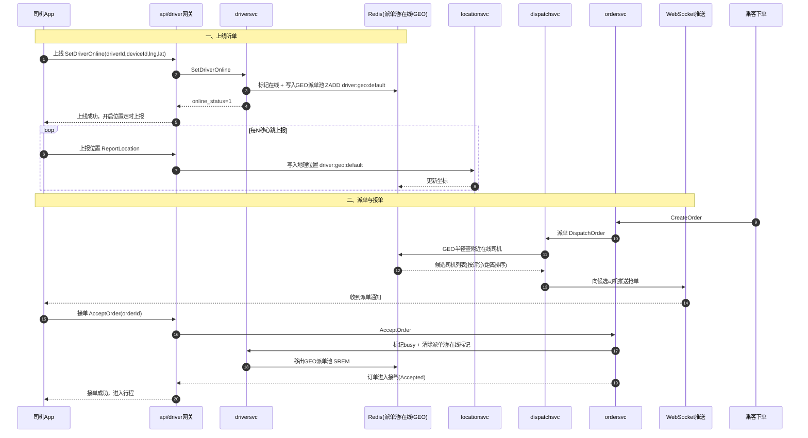
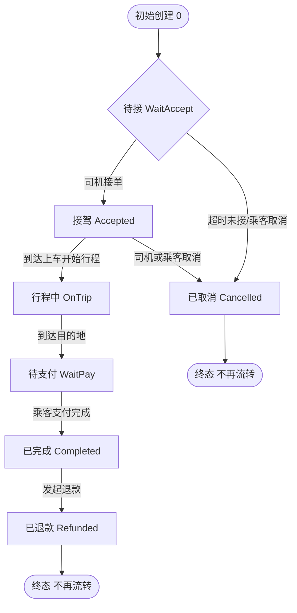

# 司机端核心机制卡片（三图）

> 配合《实训学生工作规范》（五）第 3 条「机制卡片」使用：每张图须脱稿讲 5 分钟，讲不清重画。
> 所有状态与接口均来自真实代码，文件出处见各图底部。

---

## 一、时序图：上线听单 → 派单 → 接单推送链路



**讲点（脱稿必说）**：上线把司机写进 `driver:geo:default` 派单池；派单端 `dispatchsvc` 只读同一个 key 才能查到候选，二者 key 不一致就会「搜不到单、无单可接」（本项目早期踩过的坑）。接单后必须 `SREM` 移出派单池并清 `busy`，否则服务中的司机会被重复派单。

**代码出处**：`rpc/driversvc/proto/driversvc.proto`（SetDriverOnline / ReportLocation）、`rpc/driversvc/client/local.go`（setOnlineState 写在线+GEO）、`rpc/dispatchsvc`（GEO 半径查候选）。

---

## 二、流程图：行程订单状态机（司机端视角）

状态值定义见 `rpc/ordersvc/internal/logic/state_machine.go` 的 `CanTransit`：

| 状态 | 含义 |
|------|------|
| 0 | 初始创建 |
| WaitAccept | 待接（派单中） |
| Accepted | 接驾（司机已接单） |
| OnTrip | 行程中（已上车、开始行程） |
| WaitPay | 待支付（已到达目的地） |
| Completed | 已完成（支付成功） |
| Refunded | 已退款（终态） |
| Cancelled | 已取消（终态） |



**讲点（脱稿必说）**：所有流转都过 `CanTransit` 集中校验，禁止「跳状态」（如 WaitAccept 不能直接到 OnTrip）。`OnTrip` 之后只能到 `WaitPay`，不能直接 Completed，保证「先到达、后支付、再结束」的数据一致性；取消只能在待接/接驾两态发生。

**代码出处**：`rpc/ordersvc/internal/logic/state_machine.go`、`accept_order_logic.go`、`cancel_order_logic.go`、`confirm_paid_logic.go`。

---

## 三、泳道图：提现防资损流程

```mermaid
flowchart TD
    subgraph 司机
        A1[发起提现申请] --> A2[选择本人已绑银行卡]
        A2 --> A3[输入平台提现密码]
    end
    subgraph driversvc司机服务端
        B1[校验密码 bcrypt] --> B2[校验卡为本人且实名一致]
        B2 --> B3[金额校验 有限值/两位小数]
        B3 --> B4[生成提现单 WD+时间+随机<br/>状态=申请中(pending=1)]
    end
    subgraph adminsvc管理后台
        C1[运营审核 通过/驳回] --> C2{approve?}
        C2 -->|通过| C3[置状态2 打款成功<br/>写打款时间]
        C2 -->|驳回| C4[置状态3 打款失败<br/>备注必填]
    end
    subgraph 银行通道
        D1[真实打款]
    end
    A3 --> B1
    B4 --> C1
    C3 --> D1
```

**讲点（脱稿必说）**：司机侧只「发起+记录」，不直接打款；实际打款由 `adminsvc` 审核后置状态 2（成功）或 3（失败）。防超量/重复提现的核心约束在余额计算：**可用余额 = 总收入 − 已申请 − 已打款**，申请时即冻结「已申请」部分，审核打款后计入「已打款」，三者联动防止超额提取与重复打款资损。卡号 AES 加密存储、提现密码仅首次返回一次，均为安全合规要求。

**代码出处**：`rpc/driversvc/internal/logic/create_withdraw_logic.go`（发起/密码校验/金额校验/生成单号）、`rpc/driversvc/proto/driversvc.proto`（AuditWithdraw：approve=true 置状态2并写打款时间，false 置状态3）。

---

## 验收要点（机制卡片答辩 checklist）
1. 上线图：能说清 GEO key 一致性与「接单后移出派单池」两个坑。
2. 状态机图：能背出 7 个状态名与 `CanTransit` 的流转约束，且无跳状态。
3. 提现图：能讲清「司机只发起、后台才打款」的分权设计，以及「已申请+已打款」防超量公式。
4. 三张图均能脱稿讲满 5 分钟，讲不清重画重讲。
