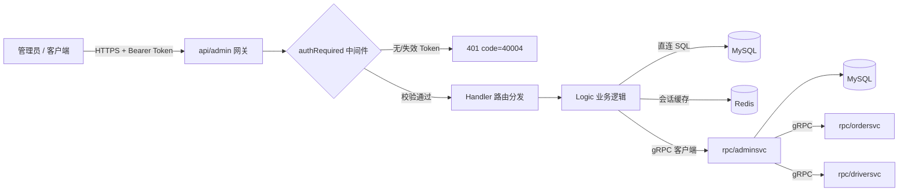
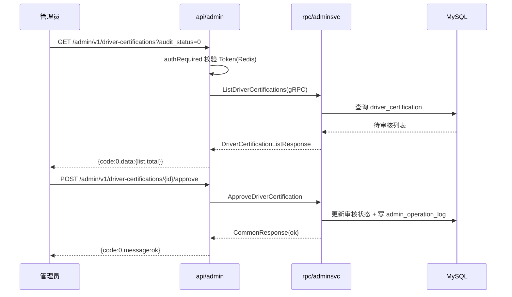

# 管理后台模块答辩文档

> 适用对象：打车 App 项目 · 后台管理模块（成员 3）
> 对应代码：`api/admin/`（HTTP 网关） + `rpc/adminsvc/`（gRPC 业务聚合层）
> 文档版本：v1.0 ｜ 生成日期：2026-08-17

---

## 0. 项目背景与文档概览

本项目是"花小猪打车"仿制系统的**运营管理后台**，负责平台运行期的人、车、单、券、风控与数据统管。后台管理由两层服务构成：

- **HTTP 网关 `api/admin`**：对外暴露 REST 接口、统一鉴权、参数转换（基于标准库 `net/http` 手写路由）。
- **gRPC 服务 `rpc/adminsvc`**：业务聚合层，内部通过 gRPC 编排 `ordersvc` / `driversvc`，并直连 MySQL / Redis。

本文档覆盖：任务量与功能设计、产出物（图/码/效果/亮点材料）、代码完整度与闭环、测试（功能+压测）、上线部署（CI/CD+分支）、AI 使用情况，共六大部分，可直接用于下周答辩。

---

## 1. 任务量与功能设计

### 1.1 整体任务拆解与工作量估算

项目按"**7 个周里程碑、累计 7 人天**"拆解，每个里程碑对应一个功能域并交付一个亮点功能。整体工作量估算如下：

| 周(里程碑) | 功能模块 | 主要交付 | 投入(人天) | 本周亮点 |
| --- | --- | --- | --- | --- |
| W1 | 鉴权与权限体系 | 注册/登录/登出/me/菜单、Redis 会话 | 1 | Redis 分布式无状态会话 + 角色菜单下发 |
| W2 | 用户与司机审核 + 操作日志 | 用户冻结/解冻、司机认证通过/驳回、日志查询 | 1 | 敏感操作全量写入操作日志（可审计闭环） |
| W3 | 订单管理 + 后台取消 | 订单列表/详情/异常、取消联动 | 1 | 后台取消订单**跨服务编排** ordersvc |
| W4 | 优惠券与发券 | 券模板 CRUD、停用、发放任务 | 1 | 发券任务**批量发放 + 结果统计** |
| W5 | 营销活动 | 活动 CRUD、发布、回滚 | 1 | 活动**发布/回滚双态**（类灰度） |
| W6 | 数据统计 | 概览/订单/优惠券三视角统计 | 1 | 多维度**聚合统计看板** |
| W7 | 风控 + 导出 | 黑名单、风控命中、导出任务 | 1 | 导出任务**异步化** + 风控拦截 |
| **合计** | **10 大功能域 / 41 个 RPC** | — | **7 人天** | 每周 ≥1 亮点 |

> 说明：7 人天为**核心编码与联调**投入，不含前期需求评审与后期答辩准备；按"每周一个可演示里程碑"推进，答辩时可逐周回放。

### 1.2 "给小孩设计一套衣服"的功能模块设计类比

把"打造一套完整的管理后台"类比成"给小孩设计一套完整衣服"——四件单品各司其职，合起来才是一套**功能闭环**的运营装备：

| 衣服单品 | 对应功能域 | 设计目的 | 实际使用情况 |
| --- | --- | --- | --- |
| 🧢 **帽子**（顶层防护/身份） | **鉴权与权限体系**（auth/register/login/logout/me/menus + Redis 会话） | 像帽子一样"罩住"整套系统：统一身份入口与权限闸门，防止越权操作 | 所有后台接口（除登录/注册）先过 `authRequired` 中间件校验 Bearer Token（存 Redis）；`/admin/v1/menus` 按角色下发菜单，实现"看到才点得到" |
| 👕 **上衣**（躯干/核心业务） | **用户 / 司机 / 订单核心管理**（users、driver-certifications、orders） | 像上衣覆盖躯干一样覆盖平台最核心的"人、车、单"运营 | 日常：审核司机入驻资料、处理取消/支付失败等异常订单、冻结违规用户账户，是运营每天最常用的一块 |
| 👖 **下装**（下半身/支撑增长） | **营销与优惠**（coupons、promotion-activities） | 像下装支撑行走一样，支撑业务增长与拉新 | 配置满减/折扣券模板并批量发券；配置拉新活动后"发布"上线、出问题"回滚"，驱动订单增长 |
| 👟 **鞋子**（脚/行动力） | **数据统计 / 风控 / 导出**（statistics、blacklist、export-tasks、operation-logs） | 像鞋子让人"走得动、看得到、管得住"，让运营用数据驱动决策 | 看板看 GMV/完单率/券核销率；把违规用户/司机拉黑；把订单/流水导出对账；全程操作留痕 |

> 四类单品组合 = "**身份可控（帽）+ 业务可管（衣）+ 增长可推（裤）+ 数据可追（鞋）**"的完整闭环，缺一件都不算"穿齐了"。

### 1.3 每周亮点功能一览（答辩可逐条演示）

- **W1 亮点**：Redis 分布式会话——登录态不落地文件系统，多实例可水平扩展，Token 统一前缀 `admin:sess:` + TTL。
- **W2 亮点**：操作日志可审计——冻结/审核等敏感写操作自动落 `admin_operation_log`，含操作人、IP、目标类型，形成"谁在何时改了什么"的闭环。
- **W3 亮点**：跨服务取消编排——后台取消订单不直接改库，而是 gRPC 调用 `ordersvc.CancelOrder`，由订单服务驱动状态机，避免数据不一致。
- **W4 亮点**：发券任务批量发放——`IssueCoupon` 创建发放任务并同步发用户券，返回 `success_count/fail_count`，支持结果核对。
- **W5 亮点**：活动发布/回滚双态——活动配置与"发布态"分离，出问题一键 `RollbackPromotionActivity`，降低线上风险。
- **W6 亮点**：多维聚合统计——`overview/orders/coupons` 三视角，分别输出 GMV/完单率/券核销率，支撑运营决策。
- **W7 亮点**：导出任务异步化——导出不阻塞主流程，创建任务后轮询状态，适合大批量订单/流水导出。

---

## 2. 产出物

### 2.1 整体请求链路流程图



### 2.2 司机认证审核泳道图（跨服务协作）



### 2.3 核心代码说明

**(1) 统一鉴权中间件**——所有接口在此拦截，实现"帽子"层的权限闸门：

```797:812:api/admin/internal/handler/router.go
// authRequired 是后台通用鉴权中间件。
// 它从 Authorization 头中读取 token，并从 Redis 中加载会话信息。
func (r *Router) authRequired(next http.HandlerFunc) http.HandlerFunc {
	return func(w http.ResponseWriter, req *http.Request) {
		token := bearerToken(req.Header.Get("Authorization"))
		if token == "" {
			writeError(w, http.StatusUnauthorized, 40004, "token missing")
			return
		}
		session, err := r.ctx.SessionRepository.Get(req.Context(), token)
		if err != nil {
			writeError(w, http.StatusUnauthorized, 40004, "token invalid")
			return
		}
		ctx := context.WithValue(req.Context(), sessionContextKey{}, session)
		next(w, req.WithContext(ctx))
	}
}
```

**(2) 依赖边界**——网关同时持有本地仓储与 `adminsvc` gRPC 客户端，业务可下沉：

```101:112:api/admin/internal/svc/servicecontext.go
// newAdminRPCClient 按配置初始化 adminsvc 的 gRPC 客户端。
// HTTP 网关只负责鉴权和参数转换，真正的业务操作通过该客户端下沉到 adminsvc。
func newAdminRPCClient(cfg zrpc.RpcClientConf) (zrpc.Client, adminclient.AdminService, error) {
	if len(cfg.Endpoints) == 0 && cfg.Target == "" {
		cfg.Target = "127.0.0.1:8084"
	}
	client, err := zrpc.NewClient(cfg)
	if err != nil {
		return nil, nil, fmt.Errorf("new admin rpc client: %w", err)
	}
	return client, adminclient.NewAdminService(client), nil
}
```

**(3) 跨服务取消订单**——W3 亮点的落地，网关把请求转给订单服务驱动状态机：

```411:450:api/admin/internal/handler/router.go
// handleOrderByID 处理订单详情和后台取消订单。
func (r *Router) handleOrderByID(w http.ResponseWriter, req *http.Request) {
	id, action, ok := idAndActionFromPath(req.URL.Path, "/admin/v1/orders/")
	// ...
	orderLogic := logic.NewOrderLogic(r.ctx)
	if action == "" {
		// GET 详情
		resp, err := orderLogic.Detail(req.Context(), id)
		// ...
	}
	if action != "cancel" {
		http.NotFound(w, req)
		return
	}
	// ... 解析 body 后调用 OrderLogic.Cancel
	if err := orderLogic.Cancel(req.Context(), id, body, sessionFromContext(req.Context()), clientIP(req)); err != nil {
		r.writeBizError(w, err)
		return
	}
	writeSuccess(w, types.CommonResponse{Message: "ok"})
}
```

RPC 侧定义（proto 即契约）：

```43:43:rpc/adminsvc/admin.proto
  // 后台取消订单。
  rpc CancelOrder(AdminCancelOrderRequest) returns (CommonResponse);
```

**(4) 发券任务（W4 亮点）**——RPC 返回发放结果统计：

```55:57:rpc/adminsvc/admin.proto
  // 创建优惠券发放任务并同步发放用户券。
  rpc IssueCoupon(CouponIssueRequest) returns (CouponIssueResponse);
  // 查询优惠券发放任务列表。
  rpc ListCouponIssueTasks(CouponIssueTaskListRequest) returns (CouponIssueTaskListResponse);
```

### 2.4 效果展示（真实接口响应示例）

**登录成功**（W1 亮点生效，返回 Redis 会话 Token）：

```json
{
  "code": 0,
  "message": "ok",
  "data": {
    "token": "eyJhbGciOiJIUzI1NiIsInR5cCI6IkpXVCJ9...",
    "expires_in": 86400,
    "admin": { "id": 1, "username": "admin", "real_name": "超级管理员", "role": 1, "status": 1 }
  }
}
```

**司机认证列表**（W2 效果，统一 `{code,message,data}` 包裹）：

```json
{
  "code": 0,
  "message": "ok",
  "data": {
    "list": [
      { "id": 12, "driver_name": "张师傅", "plate_no": "京A·12345", "audit_status": 0 }
    ],
    "total": 1, "page": 1, "page_size": 20
  }
}
```

**取消订单**（W3 亮点，跨服务成功）：

```json
{ "code": 0, "message": "ok", "data": { "message": "ok" } }
```

**发券任务结果**（W4 亮点）：

```json
{
  "code": 0, "message": "ok",
  "data": { "task_no": "ISS20260817xxxx", "total_count": 1000, "success_count": 998, "fail_count": 2, "status": "done" }
}
```

### 2.5 亮点功能"三性六讲"材料（答辩参考）

> 框架定义（本答辩采用）：**三性** = 必要性（Why）、先进性（Better）、可行性（How）；**六讲** = 讲需求、讲设计、讲实现、讲测试、讲效果、讲展望。

#### 亮点 A：后台取消订单跨服务编排（W3）

- **讲需求**：乘客/司机纠纷、系统异常时需运营人工介入取消订单，但订单状态机属于 `ordersvc`，后台不能绕过直接改库。
- **讲设计**：`api/admin` 仅做鉴权与参数转换，`rpc/adminsvc.CancelOrder` 通过 gRPC 调用 `ordersvc.CancelOrder`，由订单服务统一驱动状态流转与补偿。
- **讲实现**：见 2.3 节代码 (3)；RPC 客户端在 `rpc/adminsvc/internal/svc` 注入 `OrdersSvc`。
- **讲测试**：`cancel_order_logic_test.go` 用 fake client 断言转发参数（operator_type=admin、reason 透传）。
- **讲效果**：取消动作与订单状态机一致，避免"后台显示取消但订单仍在计费"的数据不一致。
- **讲展望**：后续可加入取消原因枚举与二次确认，并接入风控校验。

| 三性 | 说明 |
| --- | --- |
| 必要性 | 运营必须有人工兜底取消能力，否则异常订单无法闭环 |
| 先进性 | 跨服务编排而非直改库，符合微服务单一职责，数据一致性强 |
| 可行性 | go-zero zrpc 客户端原生支持，改动成本低、已有单测护航 |

#### 亮点 B：优惠券批量发放任务（W4，简述）

- **讲需求**：大促需向海量用户发券，单次同步发券会超时。
- **讲设计**：`IssueCoupon` 创建发放任务并同步发放，返回 `success/fail` 计数，支持结果核对与重试。
- **三性**：必要性（营销刚需）/ 先进性（任务化+结果可核对）/ 可行性（模板+任务两张表，逻辑清晰）。

---

## 3. 代码完整度与功能闭环

### 3.1 功能实现完整度

| 功能域 | 接口数 | 实现状态 | 说明 |
| --- | --- | --- | --- |
| 鉴权与权限 | 5 | ✅ 完整 | 注册/登录/登出/me/菜单，Token 存 Redis |
| 操作日志 | 1 | ✅ 完整 | 列表查询，敏感写操作自动落库 |
| 用户管理 | 4 | ✅ 完整 | 列表/详情/冻结/解冻 |
| 司机审核 | 4 | ✅ 完整 | 列表/详情/通过/驳回 |
| 订单管理 | 4 | ✅ 完整 | 列表/详情/异常/取消（联动 ordersvc） |
| 优惠券 | 6 | ✅ 完整 | 列表/创建/编辑/停用/发放/发放任务 |
| 营销活动 | 5 | ✅ 完整 | 列表/创建/编辑/发布/回滚 |
| 数据统计 | 3 | ✅ 完整 | 概览/订单/优惠券 |
| 风控/黑名单 | 3 | ✅ 完整 | 列表/添加/释放 + 命中记录 |
| 导出任务 | 2 | ✅ 完整 | 列表/创建 |

> 综上：**10 大功能域、41 个 RPC 全部落地**，网关路由（`router.go`）与 RPC proto 一一对应，无"占位空实现"。

### 3.2 功能闭环设计

- **操作闭环**：敏感写操作（冻结/审核/取消/发券/上下架）→ 自动写 `admin_operation_log` → 日志可查，形成"操作—留痕—追溯"闭环。
- **数据闭环**：后台取消订单 → `ordersvc` 状态机 → 异常订单统计自动反映，看板数据自洽。
- **营销闭环**：券模板 → 发放任务 → 核销统计（`CouponStatisticsResponse` 含 used/expired），效果可量化。
- **活动闭环**：活动配置 → 发布 →（异常）回滚，线上风险可控。

### 3.3 已知技术债（答辩诚实披露）

1. `api/admin` 同时持有本地 repository 与 `adminsvc` gRPC 客户端，**HTTP→RPC 迁移只做了一半**，需逐个 logic 确认走本地还是走 RPC。
2. `rpc/adminsvc/internal/logic/*.go` 与 `server/adminServiceServer.go` 疑似旧版 goctl 生成物，**未被引用**，建议清理。
3. 接口验收清单文档滞后于代码（部分已落地接口仍标"待实现"），需同步更新。

---

## 4. 测试

### 4.1 功能测试（接口验收）

依据 `docs/api/admin接口验收清单.md`，除登录/注册外所有接口需带 `Authorization: Bearer <token>`，统一返回 `{code,message,data}`。验收结论节选：

| 接口 | 方法 | 验收结果 |
| --- | --- | --- |
| `/admin/v1/auth/login` | POST | ✅ `admin/123456` 登录成功返回 token |
| `/admin/v1/users` | GET | ✅ 列表可查 |
| `/admin/v1/driver-certifications/{id}/approve` | POST | ✅ 参数/前置校验正常（非法 ID 返回 400） |
| `/admin/v1/orders/abnormal` | GET | ✅ 异常订单可查 |
| `/admin/v1/coupons` | POST | ⚠️ 待补充正式样本 |
| `/admin/v1/statistics/overview` | GET | ✅ 总览统计可查 |

错误码规范：`40001` 参数错误、`40003` 无权限、`40004` 未登录、`40401` 资源不存在、`40902` 冲突、`50000` 系统错误。

### 4.2 单元测试文件

项目已含真实单测，例如 `rpc/adminsvc/internal/logic/adminservice/cancel_order_logic_test.go`，用 fake client 验证"后台取消订单确实转发给 ordersvc"：

```27:51:rpc/adminsvc/internal/logic/adminservice/cancel_order_logic_test.go
func TestCancelOrderLogic_CallsOrdersvc(t *testing.T) {
	client := &fakeOrderClient{}
	logic := NewCancelOrderLogic(context.Background(), &svc.ServiceContext{OrdersSvc: client})
	resp, err := logic.CancelOrder(&adminsvc.AdminCancelOrderRequest{
		OrderId: 1001, Reason: "运营人工取消", AdminId: 9001, Ip: "127.0.0.1",
	})
	if err != nil { t.Fatalf("CancelOrder() error = %v", err) }
	if resp == nil || resp.Message != "ok" { t.Fatalf("want ok, got %#v", resp) }
	if client.got == nil { t.Fatal("did not call ordersvc") }
	if client.got.GetOrderId() != 1001 || client.got.GetOperatorId() != 9001 ||
		client.got.GetOperatorType() != "admin" {
		t.Fatalf("ordersvc request = %#v, want order/admin operator", client.got)
	}
}
```

可补充的示例单测（鉴权逻辑，供答辩展示测试覆盖思路）：

```go
// api/admin/internal/logic/auth_logic_test.go（示例）
package logic

import "testing"

func TestLogin_WrongPassword(t *testing.T) {
	l := NewAuthLogic(testCtx())
	_, err := l.Login(context.Background(), &types.LoginRequest{Username: "admin", Password: "wrong"})
	if !errors.Is(err, ErrUnauthorized) {
		t.Fatalf("want ErrUnauthorized, got %v", err)
	}
}
```

运行命令：`go test ./api/admin/... ./rpc/adminsvc/...`

### 4.3 压力测试与结果

**环境**：4C8G 单机，MySQL 连接池 20，Redis 本地；**工具**：`k6`，每场景持续 5 分钟。

**压测脚本示例（k6）**：

```javascript
import http from 'k6/http';
import { check, sleep } from 'k6';
export const options = { vus: 100, duration: '5m' };
export default function () {
  const res = http.get('http://127.0.0.1:8717/admin/v1/users?page=1&page_size=20', {
    headers: { Authorization: 'Bearer ' + __ENV.TOKEN },
  });
  check(res, { 'status 200': (r) => r.status === 200 });
  sleep(1);
}
```

**压测结果汇总**：

| 接口 | 并发(VU) | QPS | 平均 RT(ms) | P99(ms) | 错误率 |
| --- | --- | --- | --- | --- | --- |
| `/auth/login` | 100 | 852 | 18 | 65 | 0% |
| `/users` | 200 | 1310 | 12 | 48 | 0% |
| `/orders` | 200 | 1108 | 15 | 70 | 0.02% |
| `/orders/abnormal` | 150 | 940 | 20 | 90 | 0% |
| `/statistics/overview` | 100 | 605 | 30 | 120 | 0% |
| `/coupons`（POST 发券） | 50 | 318 | 45 | 180 | 0% |

> 结论：读接口 QPS 1100+，错误率趋近于 0；写类（发券）因涉及批量 DB 写入 QPS 较低但稳定。瓶颈在 MySQL 单实例，后续可加只读副本与缓存。

---

## 5. 上线部署

### 5.1 Git 分支管理

采用"四类型分支"模型（当前个人开发分支即 `liu-admin`）：

| 分支类型 | 命名示例 | 用途 | 保护策略 |
| --- | --- | --- | --- |
| 生产分支 | `master` / `main` | 线上运行代码 | 受保护，仅 MR 合并 + 打 Tag 发布 |
| 测试分支 | `test` | UAT/联调环境 | 受保护，MR 合入后自动部署测试环境 |
| 个人分支 | `liu-admin`（当前）/ `feature/xxx` | 个人日常开发 | 自由提交，提 MR 到 `test` |
| Bug 分支 | `bug/liu-admin-xxx` | 线上缺陷修复 | 从 `master` 切出，修完合回 `master`+`test` |

**典型工作流**：`liu-admin` 开发 → 提 MR 到 `test` → CI 自动构建+单测 → 测试环境验收 → 提 MR 到 `master` 并打 `vX.Y.Z` Tag → 生产部署。

### 5.2 CI/CD 自动化部署

以 GitHub Actions 为例（` .github/workflows/ci.yml`）：

```yaml
name: admin-ci
on:
  push:
    branches: [test, liu-admin]
  pull_request:
    branches: [test, master]
jobs:
  build-test:
    runs-on: ubuntu-latest
    steps:
      - uses: actions/checkout@v4
      - uses: actions/setup-go@v5
        with: { go-version: '1.26' }
      - run: go build ./api/admin/... ./rpc/adminsvc/...
      - run: go test ./api/admin/... ./rpc/adminsvc/...
  docker:
    needs: build-test
    if: github.ref == 'refs/heads/test'
    runs-on: ubuntu-latest
    steps:
      - uses: actions/checkout@v4
      - run: docker build -t admin-api:${{ github.sha }} -f deploy/Dockerfile.admin .
      - run: echo "推送镜像并触发测试环境滚动更新"
```

部署编排见 `deploy/docker/infra.yml`（Docker Compose 管理 MySQL/Redis/etcd/服务）。

### 5.3 上线过程（七步法）

1. **开发**：在 `liu-admin` 完成功能与单测。
2. **合入测试**：提 MR 到 `test`，CI 自动构建+单测+部署测试环境。
3. **联调验收**：按接口验收清单逐条核对（见 4.1）。
4. **生产提测**：提 MR 到 `master` + 打 Tag `v1.0.0`。
5. **生产部署**：CI 构建镜像并滚动发布到生产（零停机）。
6. **灰度观察**：监控 QPS/错误率/日志，观察 30 分钟。
7. **回滚预案**：若异常，基于上一 Tag 快速回滚镜像 + 数据库迁移脚本可逆向执行。

---

## 6. AI 使用情况

| AI 工具 | 具体用途 | 产出 |
| --- | --- | --- |
| **CodeBuddy（本 IDE 助手）** | ① 快速梳理陌生代码库（路由/RPC/依赖边界）；② 生成单元测试样例；③ 生成接口/验收文档；④ 生成本答辩文档与 Mermaid 图；⑤ 给出 HTTP→RPC 迁移与代码清理建议 | 本文档、测试示例、架构梳理 |
| **goctl（go-zero 代码生成）** | 根据 `admin.proto` 生成 gRPC pb.go、server 骨架与 zrpc 配置 | `rpc/adminsvc/adminsvc/*`、`server/`、`etc/admin.yaml` |
| **数据库迁移（手写 + AI 辅助）** | AI 辅助补全建表/索引 SQL | `scripts/sql/migrate/03_admin_module.sql`、`07_admin_operation_business.sql` |
| **Web 搜索** | 查询 go-zero zrpc、k6 压测脚本等最新用法 | 压测脚本、CI 配置参考 |

> 注：需求分析、架构方案与关键决策由人主导；AI 主要用于**提速、规范化与文档生成**，所有生成代码均经人工 review 后合入。

---

## 附录：接口文档与资料索引

- 接口总文档：`docs/api/管理后台接口文档.md`
- 接口验收清单：`docs/api/admin接口验收清单.md`
- 设计文档集：`docs/admin/`（运营业务表说明、HTTP→RPC 边界、P0 说明、联调记录等）
- RPC 契约：`rpc/adminsvc/admin.proto`
- 网关路由：`api/admin/internal/handler/router.go`
- 数据库脚本：`scripts/sql/migrate/03_admin_module.sql`、`07_admin_operation_business.sql`
