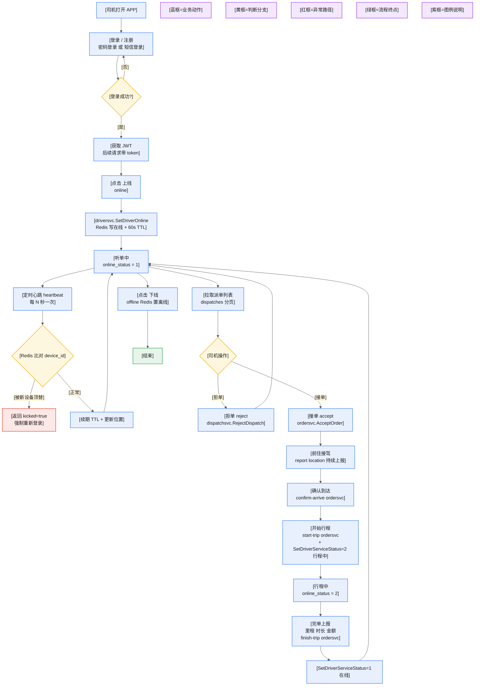

# 司机端业务主流程（全框极致版）

```mermaid
%%{init: {
  "theme": "base",
  "themeVariables": {
    "background": "#ffffff",
    "primaryColor": "#e8f0fe",
    "primaryTextColor": "#1a1a1a",
    "primaryBorderColor": "#4285f4",
    "lineColor": "#555555",
    "secondaryColor": "#fef7e0",
    "tertiaryColor": "#f3e8fd",
    "textColor": "#1a1a1a"
  }
}}%%
graph TD
    classDef step fill:#e8f0fe,stroke:#4285f4,stroke-width:1.5px,color:#1a1a1a;
    classDef decision fill:#fef7e0,stroke:#f9ab00,stroke-width:1.5px,color:#1a1a1a;
    classDef danger fill:#fce8e6,stroke:#ea4335,stroke-width:1.5px,color:#1a1a1a;
    classDef endbox fill:#e6f4ea,stroke:#34a853,stroke-width:1.5px,color:#1a1a1a;
    classDef notebox fill:#f3e8fd,stroke:#a142f4,stroke-width:1.5px,color:#1a1a1a;

    A["[司机打开 APP]"]:::step
    B["[登录 / 注册<br/>密码登录 或 短信登录]"]:::step
    C{"[登录成功?]"}:::decision
    D["[获取 JWT<br/>后续请求带 token]"]:::step
    E["[点击 上线<br/>online]"]:::step
    E1["[driversvc.SetDriverOnline<br/>Redis 写在线 + 60s TTL]"]:::step
    F["[听单中<br/>online_status = 1]"]:::step
    G["[定时心跳 heartbeat<br/>每 N 秒一次]"]:::step
    G1{"[Redis 比对 device_id]"}:::decision
    G2["[返回 kicked=true<br/>强制重新登录]"]:::danger
    G3["[续期 TTL + 更新位置]"]:::step
    H["[拉取派单列表<br/>dispatches 分页]"]:::step
    I{"[司机操作]"}:::decision
    I1["[拒单 reject<br/>dispatchsvc.RejectDispatch]"]:::step
    J["[接单 accept<br/>ordersvc.AcceptOrder]"]:::step
    K["[前往接驾<br/>report location 持续上报]"]:::step
    L["[确认到达<br/>confirm-arrive ordersvc]"]:::step
    M["[开始行程<br/>start-trip ordersvc<br/>+ SetDriverServiceStatus=2 行程中]"]:::step
    N["[行程中<br/>online_status = 2]"]:::step
    O["[完单上报<br/>里程 时长 金额<br/>finish-trip ordersvc]"]:::step
    P["[SetDriverServiceStatus=1 在线]"]:::step
    Q["[点击 下线<br/>offline Redis 置离线]"]:::step
    R["[结束]"]:::endbox

    NA["[蓝框=业务动作]"]:::notebox
    NB["[黄框=判断分支]"]:::notebox
    NC["[红框=异常路径]"]:::notebox
    ND["[绿框=流程终点]"]:::notebox
    NE["[紫框=图例说明]"]:::notebox

    A --> B
    B --> C
    C -->|"[否]"| B
    C -->|"[是]"| D
    D --> E
    E --> E1
    E1 --> F
    F --> G
    G --> G1
    G1 -->|"[被新设备顶替]"| G2
    G1 -->|"[正常]"| G3
    G3 --> F
    F --> H
    H --> I
    I -->|"[拒单]"| I1
    I -->|"[接单]"| J
    I1 --> F
    J --> K
    K --> L
    L --> M
    M --> N
    N --> O
    O --> P
    P --> F
    F --> Q
    Q --> R
```

> 注：流程图无分区标题（subgraph 标题 Mermaid 不给框，故改用右侧紫框图例说明代替）。图内所有节点、判断、连线标签、图例文字均已包入 `[...]` 框。
