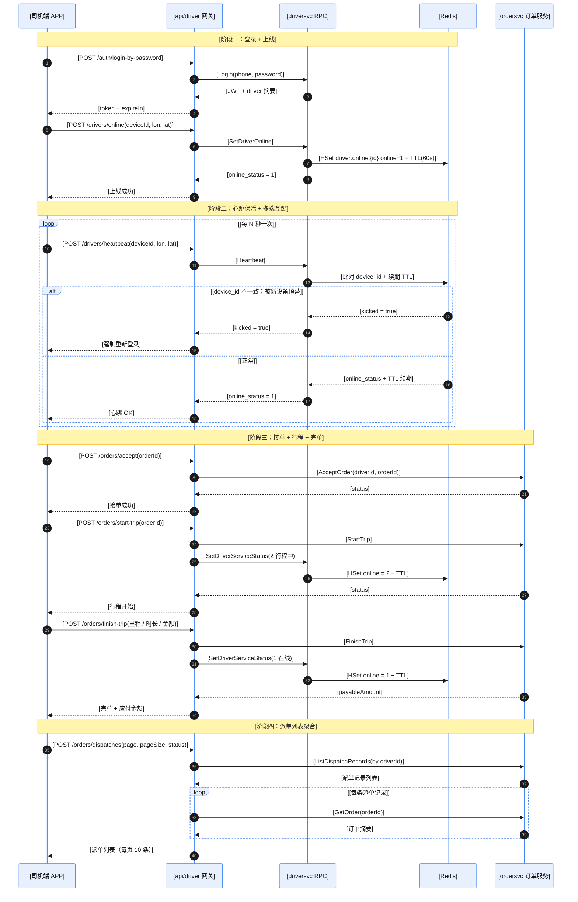

# 司机端交互时序图（全框极致版 · 白底）

```mermaid
%%{init: {
  "theme": "base",
  "themeVariables": {
    "background": "#ffffff",
    "primaryColor": "#e8f0fe",
    "primaryTextColor": "#1a1a1a",
    "primaryBorderColor": "#4285f4",
    "lineColor": "#555555",
    "secondaryColor": "#fef7e0",
    "tertiaryColor": "#f3e8fd",
    "noteBackgroundColor": "#fff8e1",
    "noteBorderColor": "#f9ab00",
    "textColor": "#1a1a1a",
    "actorBorder": "#4285f4",
    "actorBkg": "#e8f0fe",
    "actorTextColor": "#1a1a1a"
  }
}}%%
sequenceDiagram
    autonumber
    participant App as [司机端 APP]
    participant API as [api/driver 网关]
    participant DR as [driversvc RPC]
    participant RDS as [Redis]
    participant ORD as [ordersvc 订单服务]

    Note over App,RDS: [阶段一：登录 + 上线]
    App->>API: [POST /auth/login-by-password]
    API->>DR: [Login(phone, password)]
    DR-->>API: [JWT + driver 摘要]
    API-->>App: [token + expireIn]

    App->>API: [POST /drivers/online(deviceId, lon, lat)]
    API->>DR: [SetDriverOnline]
    DR->>RDS: [HSet driver:online:{id} online=1 + TTL(60s)]
    DR-->>API: [online_status = 1]
    API-->>App: [上线成功]

    Note over App,RDS: [阶段二：心跳保活 + 多端互踢]
    loop [每 N 秒一次]
        App->>API: [POST /drivers/heartbeat(deviceId, lon, lat)]
        API->>DR: [Heartbeat]
        DR->>RDS: [比对 device_id + 续期 TTL]
        alt [device_id 不一致：被新设备顶替]
            RDS-->>DR: [kicked = true]
            DR-->>API: [kicked = true]
            API-->>App: [强制重新登录]
        else [正常]
            RDS-->>DR: [online_status + TTL 续期]
            DR-->>API: [online_status = 1]
            API-->>App: [心跳 OK]
        end
    end

    Note over App,ORD: [阶段三：接单 + 行程 + 完单]
    App->>API: [POST /orders/accept(orderId)]
    API->>ORD: [AcceptOrder(driverId, orderId)]
    ORD-->>API: [status]
    API-->>App: [接单成功]

    App->>API: [POST /orders/start-trip(orderId)]
    API->>ORD: [StartTrip]
    API->>DR: [SetDriverServiceStatus(2 行程中)]
    DR->>RDS: [HSet online = 2 + TTL]
    ORD-->>API: [status]
    API-->>App: [行程开始]

    App->>API: [POST /orders/finish-trip(里程 / 时长 / 金额)]
    API->>ORD: [FinishTrip]
    API->>DR: [SetDriverServiceStatus(1 在线)]
    DR->>RDS: [HSet online = 1 + TTL]
    ORD-->>API: [payableAmount]
    API-->>App: [完单 + 应付金额]

    Note over App,ORD: [阶段四：派单列表聚合]
    App->>API: [POST /orders/dispatches(page, pageSize, status)]
    API->>ORD: [ListDispatchRecords(by driverId)]
    ORD-->>API: [派单记录列表]
    loop [每条派单记录]
        API->>ORD: [GetOrder(orderId)]
        ORD-->>API: [订单摘要]
    end
    API-->>App: [派单列表（每页 10 条）]
```

> 图内参与者名、所有消息标签、Note 文字、loop/alt/else 分支标签均已包入 `[...]` 框。白底配置见顶部 init。
