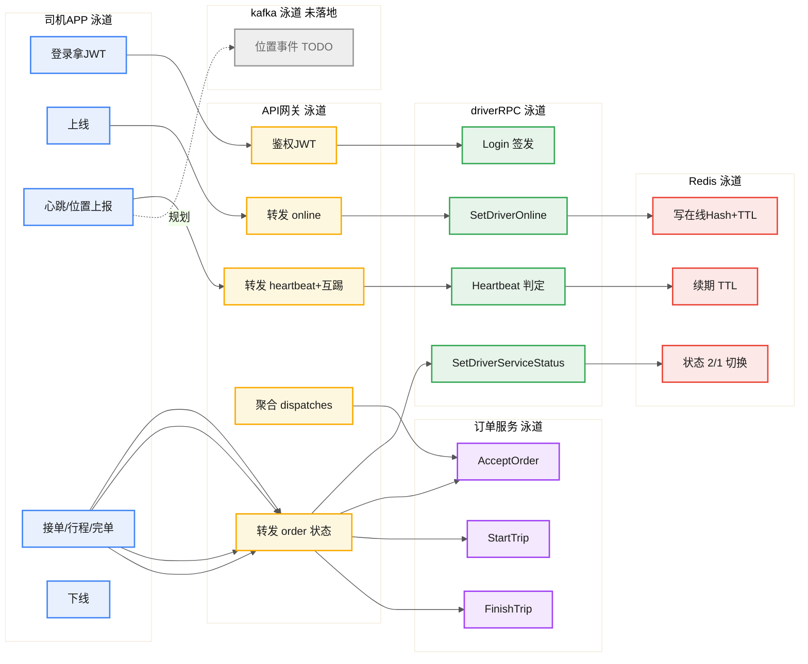

# 司机端协作横向泳道图

> Mermaid 原生不支持跨职能真泳道，下方用 `graph LR` + 每个角色一个 subgraph 横向排布，模拟横向泳道：每一列是一个角色（泳道），列内节点是该角色的动作，跨列箭头表示调用/依赖。

## 看图说明
- 六条横向泳道从左到右：司机APP → API网关 → driverRPC → Redis → 订单服务 → kafka。
- 每条泳道内用 `direction TB` 让节点纵向排列，整体呈"列=泳道、行=时序"的横向泳道观感。
- 跨泳道箭头表示调用关系（实线=已落地调用，虚线=规划中）。
- kafka 标灰 TODO：位置变更事件实训阶段未接入。
- 真实带泳道横条的图可用 draw.io 照此结构重画。
